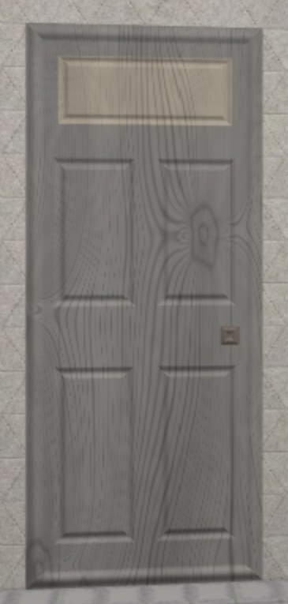

# Door Design

Reference: @src/shared/graphics/mesh/composition/types/compositionCodec/doorCompositionCodec.ts , @src/shared/graphics/mesh/composition/types/compositionConstants/doorCompositionConstants.ts , @src/shared/graphics/mesh/composition/types/compositionBuilder/doorCompositionBuilder.ts , @src/shared/object/types/objectTypeConfig/doorObjectTypeConfig.ts , @src/client/graphics/maps/materialConstructorMap.ts

## Overview

A door is a `GameObject` mounted on a wall, and the way from one room to another. It carries no
image: what is drawn is assembled at runtime out of flat quads, each one finished as moulded timber
by a material written for the purpose. Two things follow from that. A door costs no texture asset
and no download, and a door can be *given* an appearance rather than having one — which is what lets
every room's door look like its own.

## The Standard

Every door is built to one design, the panelled wooden door of the sort found in a twentieth-century
house: a slab with a moulded frame around its outline, panels let into its face either side of a
central upright, a plate above them, and a knob on the rail between the upper and lower panels.

Holding every door to one design is deliberate. A wall may eventually carry several doors at once,
and a row of them has to stay legible as a row of doors — so what varies between them is their
finish, not their shape.

The **plate** is the one region finished differently from the rest. It is where the door's name is
written, so it is placed where a sign belongs and given a colour that reads as something to be looked
at without breaking the door's own scheme.

What is written there is written *into the scene* rather than over it, as a quad standing a hair in
front of the plate and carrying the lettering as a texture. That is the whole reason it is done that
way: a caption drawn in the browser's own layer sits on top of everything, so it would announce a
door through the wall in front of it and could only be hidden or shown whole. A label in the world is
hidden by exactly as much as stands in front of it. Every label in a room shares one mesh and one
texture, a cell each, so a room full of them costs a single draw call — the same arrangement a room's
canvases are drawn through, and the reason a room may hold only so many. The component that does it
knows nothing about doors: it draws whatever text an object carries onto whatever patch of itself
that object set aside for one, in whatever colour that object carries for the purpose.

The lettering is a roman serif, which is what has always been cut into a brass plate and painted onto
a door's glass. Its colour is the one part of a door's appearance kept apart from the three the door
is finished in, and it has its own palette running the whole spectrum rather than the joinery set:
what has to be picked is a colour that reads against whatever the plate behind it was painted, and
that is not a question about joinery. An object nobody has chosen an ink for is lettered in the
colour its own kind of object declares.

## Proportions

A door claims a **footprint** of wall — the stretch nothing else may be hung over — and fills part
of it with the **panel** that is actually drawn. The panel is centred across the footprint and flush
with its bottom, and the difference between the two is margin: room to stand two doors side by side
without their frames touching, and a gap under the ceiling above.

The footprint stands exactly one storey tall, so a door reaches from the floor it is mounted on to
just under the slab over it, while the panel keeps a real door's proportions within that. A door's
own proportions come from four measurements — the uprights down each side, the one between the
panels, the rail underfoot, and the rail the knob goes through — and everything else on its face is
derived from those.

Because a wall attachment's collider is centred on its position while the door itself stands on the
floor, a door's origin sits half a footprint above the floor it is mounted on. Anything that places
a door has to account for that.

## Composition

A door is drawn through the [instanced mesh composition system](../graphics/instanced_mesh_composition.md),
the same machinery that assembles a player's body. Each region of the door's face — the slab, the
panels, the plate, the knob — is one quad, and the door's appearance is the list of them.

The regions are laid down back to front, each standing slightly in front of what it is let into.
That relief is not a nudge to break a tie: quads sharing a plane z-fight, visibly so on the
lower-precision depth buffers phones tend to have, where an offset small enough to be invisible is
also small enough to fall below what the buffer can resolve at the distance a door is seen from. A
panelled door genuinely is built up in layers, so giving each layer the depth it would really have
costs nothing and settles the question on every device.

## Appearance and Metadata

A door's appearance is three colours — the timber, the plate, and the knob — encoded by
`DoorCompositionCodec` into the object's `InstancedMeshComposition` metadata, exactly as a player's
appearance is (see [player_customization.md](player_customization.md)). The mouldings take no colour
of their own: each is worked into the timber it runs around, and is seen by its relief. The encoded
form is deliberately small and literal, which is what makes finishing a door by hand a matter of
opening a form onto those three colours. As metadata arriving from elsewhere, it is untrusted on the
read side: decoding clamps rather than trusts, and always yields a drawable door.

A door carries more than its appearance. Apart from the colour of its lettering, the rest of its
metadata is about what it *is* rather than what it looks like — what is written on it, where it opens
onto, which door of that room the traveller should arrive behind, and whether it offers itself as one
of its room's ways in. Those are described in [room_entrance.md](room_entrance.md), since they are
facts about how rooms are joined rather than about how a door is drawn.

A door that carries no appearance of its own falls back on one derived from **where it stands** —
the room it is in and its own id — rather than from who is looking at it. A client-spawned object
carries the viewing user's id, so seeding from that would give every player in a room a different
door; deriving it from the room instead makes a room's door the same for everyone and the same again
next session.

The colours come from a palette of joinery finishes — bare and stained timber, the paints that were
mixed to go on timber, and the metal and bone a knob or a plate takes. The player's palette is no use
here and the door's is no use there: a character is a tin toy lithographed in the colours a child's
toy is painted in, and almost nothing a door was ever finished in appears among them. So each has a
palette of its own, and which one a codec speaks is part of that codec's contract.

Within that palette the colours are drawn as a coordinated scheme rather than picked independently,
because three unrelated colours on one door do not look like a door somebody painted — they look like
a fault. Two constraints shape which schemes exist, and both are measured against what the material
makes of a colour rather than against the colour as written, since it is aged before anything is lit:

- **The timber stays in the middle of the brightness range.** A finish that starts dark has nowhere
  to go once the ageing, the figure and the carving have each taken something off it, and arrives as
  a black rectangle with neither grain nor joinery visible in it. The far end washes out and takes
  the mouldings' shading with it.
- **The plate stays close in brightness to the door it is screwed to.** It only has to carry black
  lettering, and the smallest step that does is the one to want: a plate that leaps off the face
  stops reading as part of the door and starts reading as a sticker on it.

## The Moulded Timber Material

Every quad of a door is drawn by a material that renders aged wood with a moulding running around
its border, with no image behind any of it — the counterpart of the aged-tin material the player's
body is made of. Its per-quad inputs are the surface colour, the moulding's colour, how wide the
moulding band is, and whether its profile stands proud of the surface or is sunk into it. The door's
outline and its knob are raised; the panels and the plate are sunk, and that contrast is most of what
makes a flat quad read as joinery.

Four things make the material work:

- **The band is measured in world units, not in the quad's own coordinates.** A moulding that
  stretched with its panel would read as a different profile on every part, so a door's frame and
  its knob would not look as though they were cut by the same hand. Measuring in world units keeps a
  band the same width whatever it frames, and the quad's real extent is recovered from its transform
  to do it. Taking the nearer of the two axes is also what mitres the corners, since the two bands
  meet along the diagonal where their distances are equal.
- **The timber's figure is sampled in world space too**, along the quad's own axes rather than
  within the quad. Nothing about it refers to the part's size, so the grain is as fine on a knob as
  on the slab behind it; and because neighbouring parts sample the same field, the figure runs on
  through all of them, as though the object had been cut out of one board. How fine that figure is
  comes from a single constant, the number of growth rings to a world unit; everything else about
  it — how far it sweeps, how wide a season's dark band runs, how big a knot grows — is measured in
  ring-widths and follows from that one number.
- **The figure is bent rather than drawn.** Growth rings are circles laid down about a trunk's pith,
  and a sawn board is a plane cutting through them, so what a face shows depends entirely on how the
  saw ran through the log. The same result is had far more cheaply by bending the coordinate the
  rings are counted along, steeply enough that it folds back on itself here and there — and a folded
  coordinate is what turns a stripe into a closed loop, which is where the nested arches of flatsawn
  timber come from. Bending it makes the rings meander, crowd and open out besides, which is the
  difference between timber and a grating. Sparse knots deflect the grain into a teardrop as it
  passes them, the way fibres had to part around a branch.
- **A moulding is seen by its relief, not by its colour.** The profile is shaded as though a raking
  light fell across the object — one flank of a bead lit and the other in shadow, and a sunk region
  holding its own shadow throughout. That light is fixed to the world, so walking around a room does
  not roll it over the carving with the viewer. It has to be supplied deliberately, because the
  scene's only lamp rides the camera: shading a profile against *that* darkens both flanks of a bead
  alike, which reads as a line drawn on a flat surface rather than as something cut into one. The
  shading normal is tilted as well, but only enough to give a moulding a highlight that travels
  along it as the viewer moves. Because relief is all a moulding has to be seen by, the bands are
  run heavy — heavier than a real door's. A band narrow enough to take in at a glance is a line
  scored around a region however carefully it is shaded; a carving needs room across it for the
  light to travel.

The material also ages the colour it is given, warming it and pulling its saturation back. That is
what the palette it draws from is chosen against: a finish that starts dark has nothing left once the
ageing, the figure and the carving have each taken something off it, and one that starts at the top
of the range washes out and takes the mouldings' shading with it. Left flat and unbroken, any of them
would read as moulded plastic rather than as timber.

Nothing about the material is specific to doors, and it is meant to be reached for again by anything
else built out of moulded rectangular surfaces — furniture, fences, pillars.

## Related docs

- [Room Entrances](room_entrance.md) — what a door carries, and where a traveller through one comes out
- [Wall-Attached Objects](wall_attached_object.md) — how a door is placed against a wall
- [Instanced Mesh Composition](../graphics/instanced_mesh_composition.md) — the system a door is assembled through
- [Player Customization](player_customization.md) — the same metadata mechanism, applied to a character
