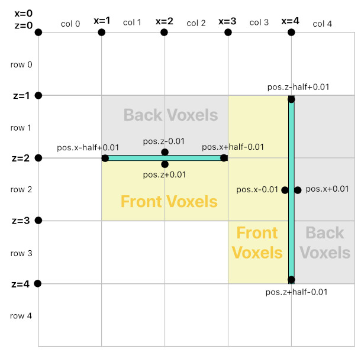

# Geometry of Attached Objects

Reference: @src/shared/object/util/objectAttachmentUtil.ts , @src/shared/object/types/objectAttachmentConfig.ts , @src/shared/physics/util/physicsColliderStateUtil.ts , @src/client/graphics/types/gizmo/objectAttachmentEditGizmos.ts

An attached object (a canvas, a prop, a [door](door_design.md), a lamp) rests on a voxel face: a wall, a floor or a ceiling. Its type's `ObjectAttachmentConfig` lists the facings it may take (walls only for doors and labels, any face for canvases, props and lamps), and the placement rule enforces it on the server as well.

## Frame
- The facing is the normal of the face the object rests on: up for a floor, down for a ceiling.
- Each facing lays the object out on one fixed frame (`Geometry3DUtil`): walls keep the object upright, and floors and ceilings give it a fixed "up" along the ground. A transform carries no roll, so a non-square object is shaped by resizing, not by turning.
- The collider, the selection outline and its handles, and the rendered rotation all read this frame.
- A canvas's or prop's content turns in quarter-turns instead (`QuarterTurns` metadata, `QuarterTurnsUtil`): its rotate tool swaps the footprint's width and height where it stands, as a lamp's size change does, and the picture turns with it. The turn lives in the content because composed parts never take their parent's roll (`InstancedPartUtil`).
- A move to another face keeps the turn the content shows on screen: its top points the way it looked, measured from where the drag started, and an odd change of turn swaps the footprint too, so the object keeps its shape as seen. A new canvas or prop on a floor or ceiling starts upright for the viewer the same way.
- **Trap**: a stored facing decodes slightly off its axis. Rendering builds the rotation from the frame rather than by `lookAt`, which would leave a floor or ceiling object's roll to that error.

## Quantization
- Facings snap to the nearest axis. Positions across the face snap to a grid of a quarter voxel, so an object half a voxel across can sit flush with a block's edge:
  - the face lies on its plane, a block boundary;
  - horizontal centres snap to the grid;
  - vertically, the **bottom edge** snaps, not the centre, so an object stands on the grid whatever its height.
- The collider is centred on the position, so a door's origin sits half its height above the floor.
- The collision test box is shrunk slightly along the face's own axes (in `PhysicsColliderStateUtil`), so that neighbours sharing an edge never register as overlapping.
- **Trap**: a stored position decodes slightly below the value that was written, so an origin can land on either side of its face. Always find the block an object rests on from its facing, never from the cell its origin falls in.

## Placement validity

Checked at the object's own size, not its type's (see [object_update.md](../networking/object_update.md)). A placement is valid when:
- its type allows the facing;
- the whole footprint lies inside the room. Its face may lie on the room's floor or ceiling, but nothing may reach past them;
- every block **behind** the footprint is solid (the object is supported). Past the layer range lie the room's own floor and ceiling, which count as solid;
- at least one block **in front** of it is open (the object is not buried);
- it does not overlap another attached object.

## Moving
The selected object is moved by dragging the inside of its selection outline (`ObjectAttachmentEditGizmos`). It goes to whichever drawn face is under the pointer (`ClientVoxelQueryUtil`: a grid walk that ignores objects and passes through blocks the orbit camera has hidden). A face its type may not face counts as its own face's plane instead.
- On its own face, the spot taken hold of stays under the pointer. On another face, the object is centred on the pointer.
- Where it doesn't fit (`ObjectAttachmentUtil`), it slides back toward where it stood on the same face, or takes the nearest spot within half its footprint on another. Failing both, it stays put.
- Among the spots it would take, one whose whole face is in the open wins over a partly covered one, so a spot snapped half into the foot of a wall gives way to one beside it. A partly covered spot is still valid, and still taken when nothing clear is near.
- Adding an object from a selected face uses the same search. A door instead stands on the storey floor.
- A new object's size is its type's to choose, given which sizes that search finds a place for (`ObjectScalingConfig.getDefaultScale`). A canvas is a whole block wherever one fits, shifted up or down a wall if need be, and one layer tall where not (the side of a lone block). A prop takes a random image among those whose size fits.
- A drag previews locally, and the server hears one transform, on release.

## Resizing
A type with an `ObjectScalingConfig` is resized by the outline's corner handles, one step of its scale at a time, unless its config turns the handles off.
- The corner opposite the dragged one holds exactly still, since sizes come in half-voxel steps and half of one is on the grid.
- A size that doesn't fit is refused, and the object keeps the last size that did.
- A lamp has no handles. It comes in a few sizes, picked from its edit options and applied **where it stands** (`ObjectAttachmentUtil.getResizedInPlace`): the centre stays put across the face, except vertically, where the bottom edge does, so picking the earlier size puts it back exactly. The list offers only the sizes that fit there, asked by the same rule the server applies to the resulting transform.
- Metadata can pin the scale (`ObjectScalingConfig.getFixedScale`): a prop is exactly its image's size, turned. It has no handles, and a change that moves the pin (a new image, a turn of a non-square one, a move that turns it) sends its transform inside the metadata signal (`SetObjectMetadataSignal.transform`), so the two are checked and applied as one edit. A new image's size is tried each way over where the prop stands (`ObjectAttachmentUtil.getResizeCandidates`): holding its bottom edge, then its top, then its centre, and likewise its left edge, right edge and centre. The first that fits is sent, and the image panel dims images that fit no way. A canvas is never pinned: its painting is fitted to whatever size it is.

## Removing the supporting block
A block that holds up attached objects cannot be removed on its own. The user can instead remove the block together with its attachments after confirming, but only when the user may remove every one of those attachments. A door, for example, keeps its wall for anyone but the room's superuser.
