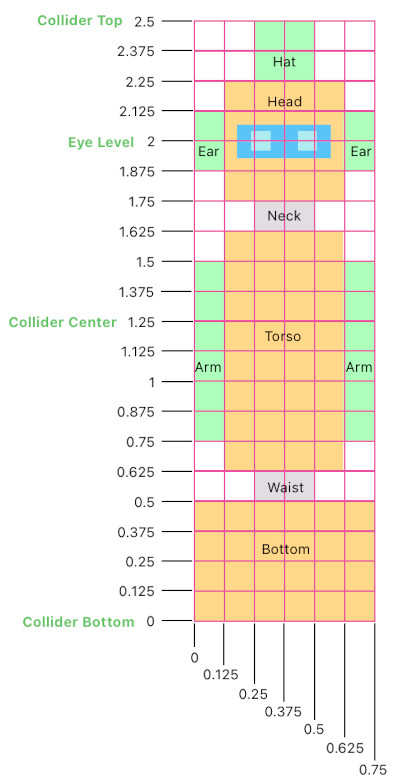
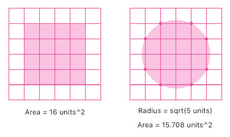
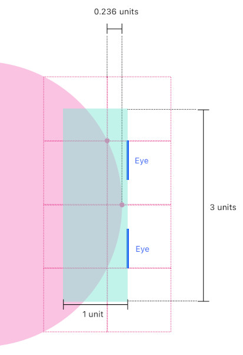
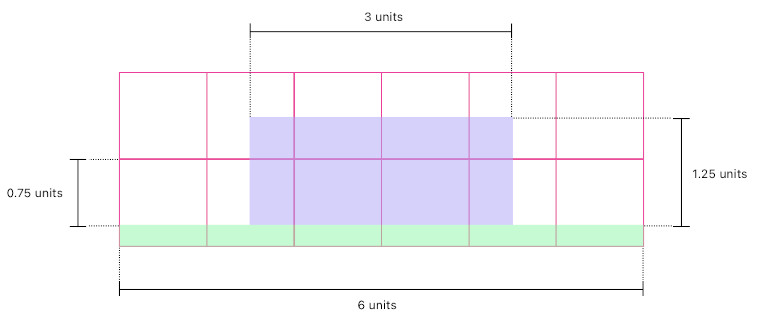
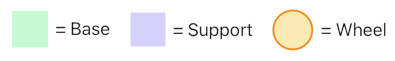
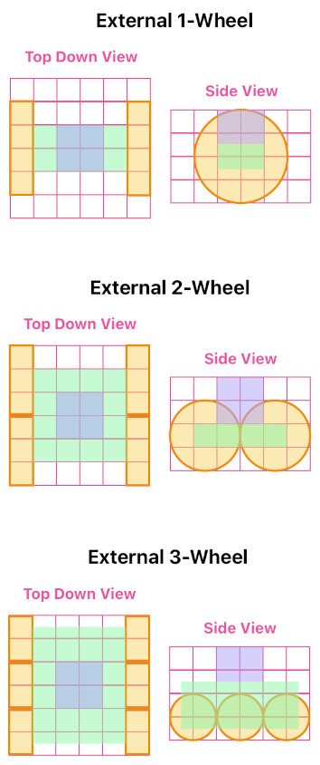

# Player Customization System

Reference: @src/shared/graphics/mesh/composition/types/compositionCodec/playerCompositionCodec.ts , @src/shared/graphics/mesh/composition/types/compositionParams/playerCompositionParams.ts , @src/shared/graphics/mesh/composition/types/compositionBuilder/playerCompositionBuilder.ts , @src/client/object/types/playerGameObject.ts , @src/client/object/components/instancedMeshComposer.ts , @src/client/ui/components/form/customizePlayerForm.tsx

## Overview

Each user is able to customize the visual appearance of his/her own player character, by adjusting a list of parameters in the in-game UI (see `customizePlayerForm.tsx`). During the in-game customization process, the camera temporarily moves slightly away from its usual location and looks back at the player character, so as to let the user watch his/her character that is being customized.

## Underlying Logic

A user's player customization parameters are encoded as base-94 ASCII characters and saved as an object metadata string (of type `InstancedMeshComposition`) inside the user's `playerMetadata` data field. This lets the customization state persist across different sessions.

The player customization logic is driven by the generic "InstancedMeshComposition" system, which allows each `GameObject` render itself by composing a number of "graphical building blocks" (i.e. instances) from any arbitrary set of instanced meshes (with the help of the `InstancedMeshComposer` component).

## Design Standards

The player's body is essentially an assembly of primitive geometric forms (e.g. boxes, cylinders, squares) which are disposed at specific offsets from the player's center location.

### Grid

In order to keep track of the offsets efficiently, I have come up with a discrete coordinate system which subdivides the player's body into grid cells (see the figure below).

The offset of each individual body part (geometric form) is expressed in terms of the number of grid cells, rather than raw X,Y,Z coordinates.

### Circular Shapes

There is one tricky case in which fitting a geometric form in an integer number of grid cells (or an integer fraction of a cell) is not appropriate. A form which produces circular cross sections, such as a cylinder, falls into this category.

Suppose that a customization option lets the user decide whether to fit a box or cylinder inside a 4x4 grid space. The following figure shows these two cases in a top-down view.

Fitting a circular cross section inside a 4x4 grid space will make the circle too small, as well as leave awkward empty spaces (gaps) between its border and neighboring shapes. Fitting it inside a 5x5 or even 4.5x4.5 grid space, on the other hand, will make the circle too big, as well as overwhelm its neighboring shapes by trespassing regions outside the 4x4 grid.

The solution is to make the circle just as large as to let it fully cover the middle 2 grid cells (on every side of the 4x4 grid space), but not larger. It happens to be the case that, at this particular size, the area of the circle is approximately 15.708, which is very close to that of a 4x4 grid (i.e. 16). In addition, this exact size lets us safely attach other geometric shapes that are adjacent to at least the middle 2 grid cells on each side, without leaving unexpected spatial gaps.

### Surface Material

The player's solid forms are rendered with the `InstancedTin` material, which treats the color the user picked for a body part as aged paint over sheet metal instead of as a flat fill, so that the character reads as an antique tin toy rather than as a plastic figurine. The material derives the whole effect procedurally from the fragment's position within its own part, without any texture: paint wears through to bare metal along the part's edges and corners, corrosion blooms out of those worn spots and across scattered patches, and a fine grain mottles both the paint and its sheen. The metallic impression comes mostly from the sheen, which the material varies across the surface — bare metal glints, intact paint stays glossy, and corroded areas turn matte.

The sheen also has to account for the scene's lamp being mounted on the camera. With the light and the viewer sharing a position, the usual highlight model degenerates: every surface turned toward the viewer peaks at once, so flat faces flare to the lamp's color all at the same time, and the angular falloff that distinguishes metal from plastic disappears. The material therefore derives its own falloff from the viewing angle, keeping the sheen restrained where a surface faces the viewer squarely and letting it rise toward the piece's silhouette — the way a real metal surface behaves. A highlight is additionally compressed as it grows, so that a piece lit from close up approaches white without ever flattening into a featureless patch.

The player's face is the deliberate exception: it is drawn on flat squares that keep the plain instance-colored material, so that the eyes stay clean and legible instead of being eaten into by the weathering.

### Eyes on a Curved Surface

Since the player's eyes are flat patches of color rendered on a flat surface, it can be problematic if we try to render the eyes on the side of a cylinder. Therefore, it is necessary to pad the cylinder's side with a box so as to provide a flat surface for the eyes. The figure top-down view illustrates how this solution is implemented. The circle shape is a cross section of the cylinder (which is the player's head).

### Case-by-Case Design

- Design of `PlayerHat`: 
    - Type 1: 
         

- Design of `PlayerBottom`: 
     
    - Type 0,1,2: 
         

## Related docs

- [Instanced Mesh Composition](../graphics/instanced_mesh_composition.md) — underlying mechanism which powers the player customization logic
- [Camera Control](../graphics/camera_control.md) — the self-view camera mode used while customizing the character