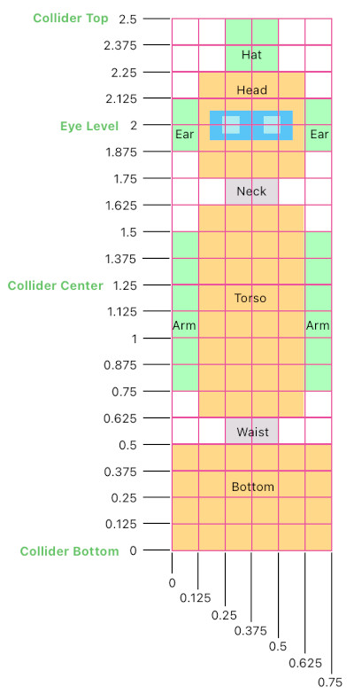
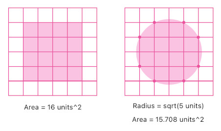
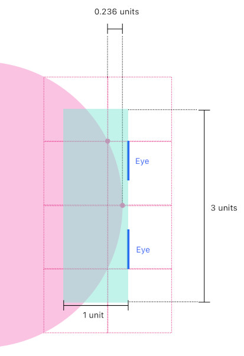

# Player Customization System

Reference: @src/shared/graphics/mesh/composition/types/compositionCodec/playerCompositionCodec.ts , @src/shared/graphics/mesh/composition/types/compositionBuilder/playerCompositionBuilder.ts , @src/client/object/types/playerGameObject.ts , @src/client/ui/components/panel/customizePlayerPanel.tsx

The character's appearance is an `InstancedMeshComposition` (see [instanced_mesh_composition.md](../graphics/instanced_mesh_composition.md)). Its parameters are encoded as a compact base-94 string that is stored in the user's `playerMetadata`. The customization panel is visible while the user's own character is selected in edit mode.

- A color is stored as an index into the player's own palette of vivid "tin toy" hues. **Palette entries are only ever appended**, because reordering them would change every saved character.
- The face is drawn with the unlit material, so its colors are kept dim enough to read as paint rather than as a light.

## Design standards
The body is built from primitives placed on a discrete grid. Offsets are counted in grid cells rather than raw coordinates.

- **Circular shapes**: a cylinder in an N×N space is sized to fully cover the middle two cells on each side, and no larger. Its area then roughly matches the square's, and neighbors attach without gaps.

  
- **Eyes on a cylinder**: the head's side is padded with a box so the flat eyes have a flat surface.

  

Reference designs: `PlayerHat` type 1 ([figure](figures/player_customization_4.jpg)); `PlayerBottom` components ([figure](figures/player_customization_5.jpg)) and types 0–2 ([figure](figures/player_customization_6.jpg)).
