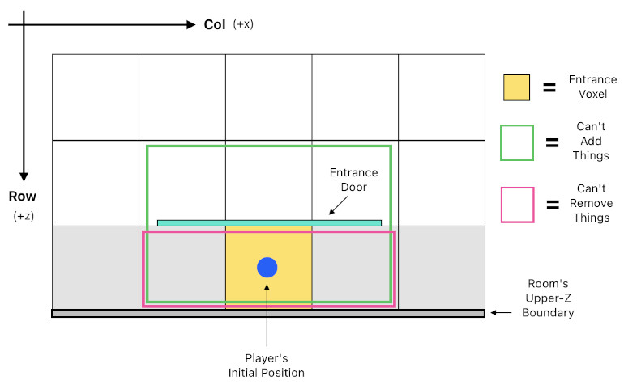
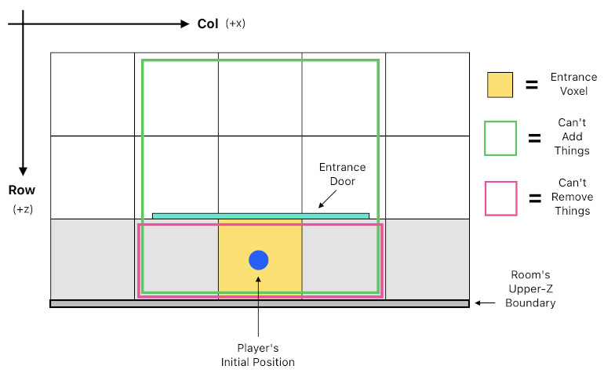
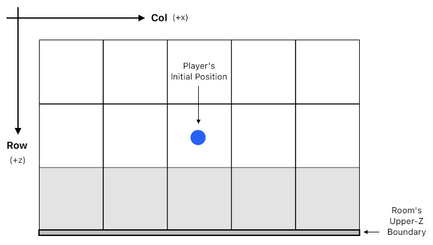

# Room Entrance Structure

Reference: @src/shared/system/sharedConstants.ts , @src/shared/room/util/roomGenerationUtil.ts , @src/shared/room/util/roomGenerationHelperUtil.ts , @src/shared/voxel/util/voxelUpdateUtil.ts , @src/shared/voxel/types/voxelGrid.ts , @src/shared/physics/types/physicsRoom.ts , @src/shared/object/types/objectTypeConfig/doorObjectTypeConfig.ts , @src/client/object/types/doorGameObject.ts , @src/client/object/clientObjectManager.ts , @src/server/room/serverRoomManager.ts

## Overview

Every room has exactly one **entrance** — a fixed doorway in the room's boundary wall through which every player enters. It is the single gateway used to travel between rooms.

The entrance is anchored to one voxel cell. For multi-player rooms (Hub/Regular) it is identified by the constants `MULTI_PLAYER_ENTRANCE_VOXEL_COL` (16) and `MULTI_PLAYER_ENTRANCE_VOXEL_ROW` (31); single-player rooms use `SINGLE_PLAYER_ENTRANCE_VOXEL_COL` (16) / `SINGLE_PLAYER_ENTRANCE_VOXEL_ROW` (30) instead (see [single_player_mode.md](../networking/single_player_mode.md)). The rest of this section describes the multi-player entrance. Because row 31 is the last row (`NUM_VOXEL_ROWS - 1`), the multi-player entrance sits in the middle of the room's upper-Z boundary wall.

Three things occupy this cell:
1. A **doorway opening** carved into the boundary wall, so the wall reads as an open passage.
2. An invisible **entrance collider** that plugs the opening, so players cannot physically walk out through it.
3. A clickable **Door object** rendered on the inner wall face — the interactive gateway to other rooms.

Players always spawn at this cell when they enter or switch rooms.

## Coordinates & Spawning

- Grid axes: column → +x, row → +z. Voxel `(row, col)` spans `x ∈ [col, col+1]`, `z ∈ [row, row+1]`.
- Entrance cell center (XZ): `(MULTI_PLAYER_ENTRANCE_VOXEL_COL + 0.5, MULTI_PLAYER_ENTRANCE_VOXEL_ROW + 0.5)` = `(16.5, 31.5)`.
- **Player spawn** (`ServerRoomManager.changeUserRoom`): `{x: MULTI_PLAYER_ENTRANCE_VOXEL_COL + 0.5, y: 0.5 × PLAYER_HEIGHT, z: MULTI_PLAYER_ENTRANCE_VOXEL_ROW + 0.5}`. There is no longer any per-user "last position"; every entry and room switch places the player here (see [user_state_management.md](../networking/user_state_management.md)).
- **Door object** (`ClientObjectUtil.spawnEntranceDoor`): positioned at `{x: MULTI_PLAYER_ENTRANCE_VOXEL_COL + 0.5, y: 0, z: MULTI_PLAYER_ENTRANCE_VOXEL_ROW}`, facing `-z` (into the room). `z = 31` is the inner face of the boundary wall.

## The Doorway Opening (carving the wall)

`RoomGenerationUtil.generateRoom` (via `generateMultiplayerRoom`) builds the room's perimeter walls, then hollows out the entrance so the player is not blocked the moment they spawn:

- `RoomGenerationHelperUtil.removeWall(voxels, MULTI_PLAYER_ENTRANCE_VOXEL_ROW, MULTI_PLAYER_ENTRANCE_VOXEL_COL, 0, 4)` clears collision layers 0–4 of the entrance voxel, leaving layers 5–7 solid as a lintel above the opening.

Rooms persisted before this feature are patched by the `VoxelGrid` encoder's **version 0 → 1 converter** (`voxelGrid.ts`): it fills the four corner cells and carves the same entrance opening, so existing rooms gain a valid entrance the next time they are loaded.

## The Entrance Collider (plugging the opening)

Carving the wall would otherwise let players walk straight out of the room into empty space. To prevent that, `PhysicsRoom` adds an invisible `entrance` collider over the opening:

- Centered at `{x: MULTI_PLAYER_ENTRANCE_VOXEL_COL + 0.5, y: MID_ROOM_Y, z: MULTI_PLAYER_ENTRANCE_VOXEL_ROW}` with half-size `{0.5, 0.5 × MAX_ROOM_Y, 1}` — one voxel wide, full room height, two voxels deep (reaching one cell into the room).
- It is a hard collider (`applyHardCollisionToOthers: true`) with zero soft-collision force, so it stops the player roughly one cell short of the doorway without pushing them around.

The `entrance` collider is part of the room's `globalColliders` set, alongside the floor, ceiling, and four perimeter walls (see [physics.md](physics.md#global-colliders-room-boundaries)). The net effect: the entrance looks like an open doorway but is sealed against walk-through — the only way out is to interact with the Door.

## The Door Object

The door is the `Door` GameObject type (`DoorObjectTypeConfig`, object type index 3):

- **Non-persistent and client-only.** Each client spawns its own Door locally during room load (`ClientObjectManager.spawnDoor`), with `addToRoomData = false` and a `#`-prefixed client-only id. It is never written to the DB nor sent over the network (see [Local-Only Objects](../networking/object_update.md#local-only-objects-addtoroomdata--removefromroomdata)). All of `canUserAddObject` / `canUserRemoveObject` / `canUserSetObjectTransform` / `canUserSetObjectMetadata` return `false`, so players cannot create, delete, move, or re-skin it.
- **Appearance.** A flat textured square (`meshGraphics`, `door.webp`) sized to the doorway and mounted on the inner wall face.
- **Collider.** A thin pass-through collider matching the mesh footprint (`applyHardCollisionToOthers: false`) — the wall and entrance collider behind it already block the player, so the door itself does not need to.
- **Interaction.** A `playerProximityDetector` (`maxDist` 3.5, `maxLookAngle` 0.25π) drives a `speechBubble`:
  - On proximity start the door shows **"Click to Enter"**; on proximity end it clears the message.
  - Clicking the door *while in proximity* opens the room-list popup (`PopupUtil.openPopup({popupType: "roomList"})`), from which the player picks another room to travel to. Clicking out of proximity does nothing.

## Constraints Near the Entrance

### Regular Room (Multiplayer)

(TODO: Add Explanations)

### Hub Room (Multiplayer)

(TODO: Add Explanations)

### Singleplayer Room

(TODO: Add Explanations)