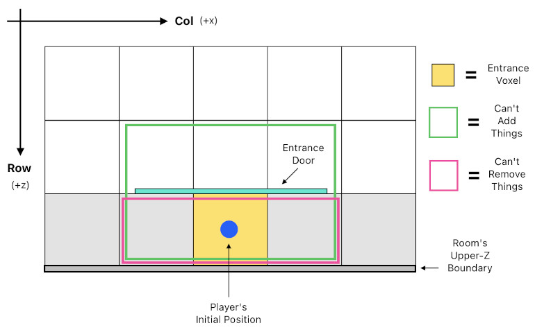
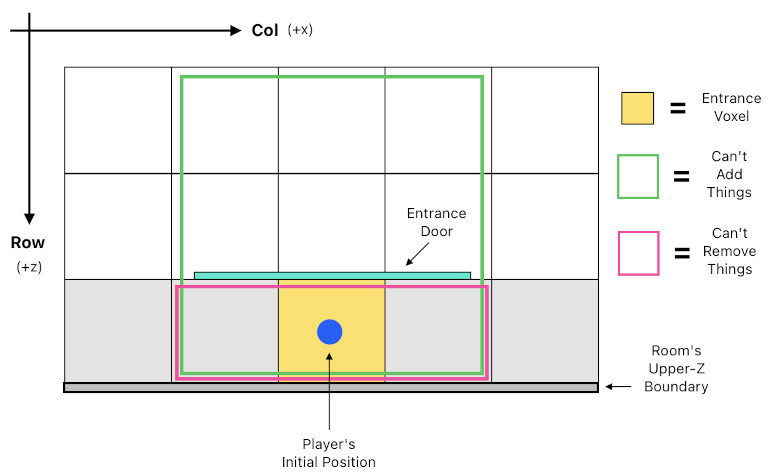

# Room Entrance Structure

Reference: @src/shared/room/util/roomValidationUtil.ts , @src/shared/physics/types/physicsRoom.ts , @src/client/object/util/clientObjectUtil.ts

## Overview

Every room has exactly one **entrance** — a fixed doorway in one of the room's boundary walls, through which every player enters. It is the single gateway for traveling between rooms, and players always spawn here when they enter or switch rooms.

The entrance is anchored to one voxel cell, positioned along the middle of a boundary wall. Three things occupy that cell:

1. A **doorway opening** carved into the boundary wall during room generation, so the wall reads as an open passage (see [room_generation.md](room_generation.md)).
2. An invisible **entrance collider** that plugs the opening, so players cannot physically walk out of the room through it.
3. A clickable **Door object** rendered on the inner wall face — the interactive gateway to other rooms.

Multi-player rooms (Hub/Regular) and single-player rooms each place the entrance at their own fixed cell; for a single-player room the location comes from that mode's configuration (see [single_player_mode.md](../networking/single_player_mode.md)).

## Player Spawning

Players always spawn just inside the entrance cell. There is no per-user "last position" — every entry and every room switch places the player at the entrance (see [user_state_management.md](../networking/user_state_management.md)).

## The Entrance Collider

Because the doorway opening is a real gap in the boundary wall, a player could otherwise walk straight out of the room into empty space. To prevent that, `PhysicsRoom` seals the opening with an invisible collider. It blocks movement without applying any soft push, so it stops the player just short of the doorway rather than nudging them around. It belongs to the room's set of boundary colliders, alongside the floor, ceiling, and perimeter walls (see [physics.md](physics.md#global-colliders-room-boundaries)). The net effect: the entrance looks like an open doorway but is sealed against walk-through — the only way out is to interact with the Door.

The plug stands exactly as tall as the doorway it fills, and no taller. A room is taller than the storey the entrance opens onto (see [voxel_grid.md](voxel_grid.md#storeys)), and the boundary above the doorway is ordinary wall — so a plug carried up through the room's whole height would put an invisible obstacle across a floor nobody can reach the doorway from anyway.

## The Door Object

The door is its own GameObject type. It is **client-only and non-persistent**: each client spawns its own Door locally during room load, and it is never written to the database nor sent over the network (see [Local-Only Objects](../networking/object_update.md#local-only-objects)). Players cannot create, delete, move, or re-skin it.

- **Appearance.** A flat textured panel sized to the doorway and mounted on the inner wall face.
- **Collider.** A thin pass-through collider — the wall and entrance collider behind it already block the player, so the door itself does not need to.
- **Interaction.** When the player is close enough, is looking its way, and stands in front of its face, the door prompts them to enter. All three conditions are needed: a player who has just arrived stands *in* the doorway, behind the panel and looking straight through it on their way out into the room, and prompting them there would flash an invitation to leave again over a door they are walking away from. The same condition rules out reaching a door from flat against the wall beside it, where the panel is edge-on. Clicking it then opens the room-list popup, from which the player picks another room to travel to. (In single-player mode a feature flag can instead send the player straight to a hub — see [single_player_mode.md](../networking/single_player_mode.md#door-behavior).) Clicking out of proximity does nothing.

## Editing Constraints Near the Entrance

To keep the entrance functional, voxel editing is restricted around it (enforced by `RoomValidationUtil`). Two distinct zones apply:

- A **no-addition zone**, where players cannot place new voxel blocks. This keeps the spawn area and the approach to the doorway from being walled in.
- A **no-removal zone**, where players cannot remove voxel blocks. This keeps the wall structure framing the doorway intact.

Both are volumes rather than patches of floor, and both stand only as high as the storey the entrance opens onto. Everything they exist to protect — the doorway, the wall framing it, the floor an arriving player spawns on — is on that storey, and the room above it is ordinary room: somewhere an owner should be as free to build as anywhere else, and which nobody can even reach the doorway from. The figures below therefore show each zone's footprint on the ground floor; nothing above that floor is restricted.

### Regular Room (Multiplayer)

In a Regular room the protected zones are kept tight: the no-addition zone covers the entrance cell and its immediate neighbors, and the no-removal zone covers just the entrance's own row. Owners and editors are otherwise free to build right up to the edge of the entrance area.

### Hub Room (Multiplayer)

A Hub is a shared thoroughfare with heavy foot traffic, so its no-addition zone reaches further into the room than a Regular room's, reserving a larger clear area in front of the entrance so that arriving players are never boxed in. Its no-removal zone is the same as a Regular room's.

### Singleplayer Room

A single-player room has no entrance editing constraints. Editing there is purely local and never persisted, and the room is rebuilt from its template each session, so there is nothing to protect — the player may build freely anywhere. This lets a tutorial teach building without restriction.
