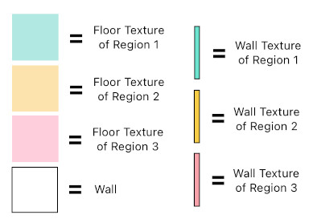
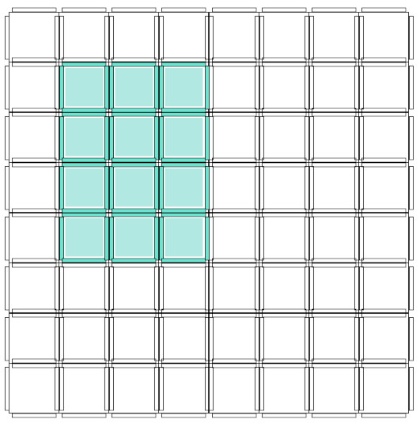
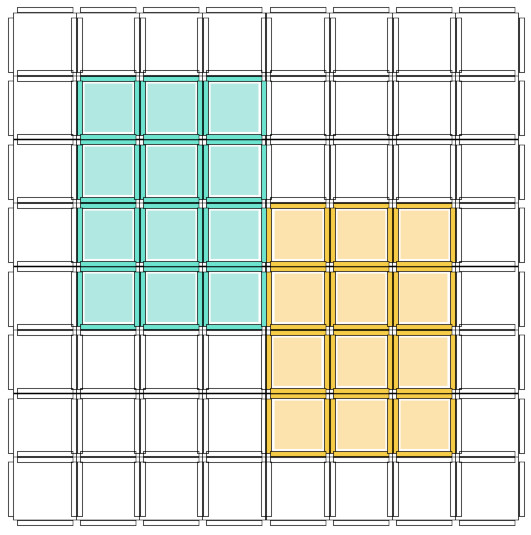
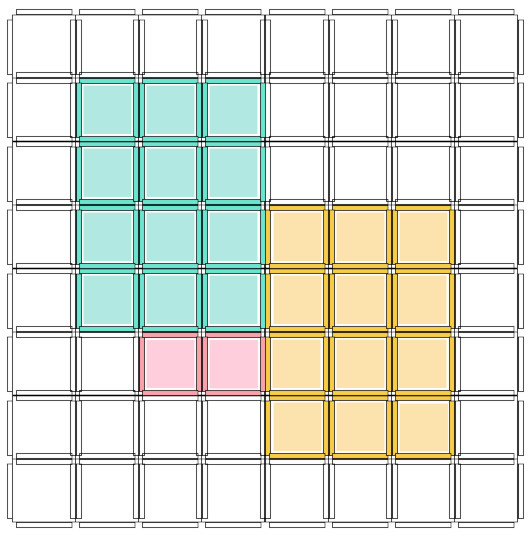
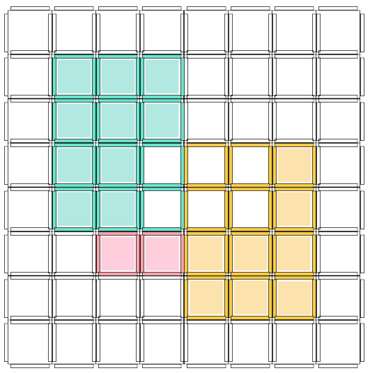
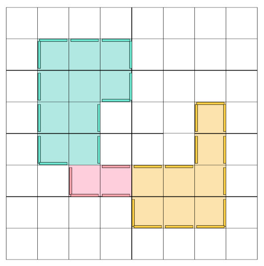
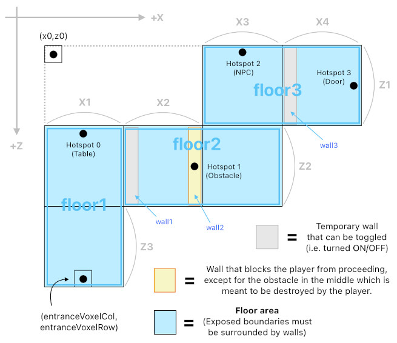

# Room Generation System

Reference: @src/shared/room/util/roomGenerationUtil.ts , @src/shared/room/util/roomGenerationHelperUtil.ts , @src/shared/room/types/roomGeneration/roomGenerationVoxel.ts , @src/shared/room/types/roomGeneration/roomGenerationVoxelGrid.ts , @src/shared/singlePlayer/maps/singlePlayerModeConfigMap.ts

## Overview

The room generation system lets us procedurally generate a room's content (i.e. `VoxelGrid` and `ObjectGroup`) without having to manually edit the individual voxels/objects by hand. Both multiplayer and singleplayer rooms are initially built by this system, via `RoomGenerationUtil`.

In case of multiplayer rooms, the system is also responsible for the room's boundary: it raises the perimeter walls and carves the doorway opening for the room's single entrance into one of them (see [room_entrance.md](room_entrance.md)).

## Room Generation Grid

Although `RoomGenerationHelperUtil` provides us with a handful of useful methods to manipulate a room's content, they may still be too primitive for us to use when it comes to designing things on a larger scale, such as splitting the room into regions, establishing boundaries among them, and so on.

### Process

A `RoomGenerationVoxelGrid`, by default, is entirely filled with walls (No empty space). Therefore, we need to selectively carve out these walls, one rectangular region at a time. Each region has its own floor, ceiling, and surrounding wall textures. Once regions are allocated, we can then proceed to split these regions by creating walls between them. This whole process (i.e. Region creation -> Wall creation) is sufficient to let us partition our room into distinct regions (each of which is uniquely textured), which are separated by walls.

### Example

Here is an example which demonstrates how the preliminary room generation process of `RoomGenerationVoxelGrid` works.

#### Basic Setup

The following image shows a set of graphical elements which will be used to illustrate our example.

#### Steps

1. Create Region 1.

2. Create Region 2 that is adjacent to Region 1.

3. Create Region 3 that is adjacent to Region 1 and 2.

4. Create Walls to add some boundaries between the regions.

5. Finalize the `RoomGenerationVoxelGrid`. This produces the room's actual `VoxelGrid` from the current layout of regions and walls.

## Tutorial Room

Every first-time user automatically enters the "tutorial room" in order to participate in the tutorial. The initial construction of the tutorial room relies heavily on the room generation system (i.e. `RoomGenerationVoxelGrid` and `RoomGenerationHelperUtil`), and its dimensions are parameterized for easy adjustment. Because the tutorial room is a single-player room, this construction happens on the client (the server stores no copy of it — see [single_player_mode.md](../networking/single_player_mode.md)). The overall structure of the tutorial room is shown below.

