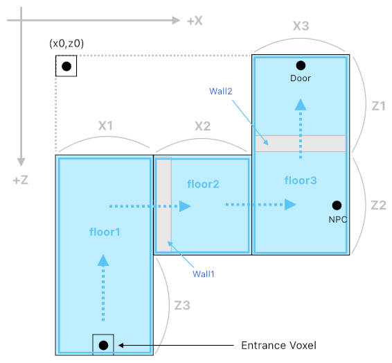

# Room Generation System

Reference: @src/shared/room/generation/util/roomGenerationUtil.ts , @src/shared/room/generation/util/roomVolumeUtil.ts , @src/shared/room/generation/types/roomVolume.ts , @src/shared/room/generation/types/roomVolumeType.ts , @src/shared/room/generation/types/roomPalette.ts , @src/shared/room/generation/types/params/roomBuilderParams.ts , @src/shared/room/generation/types/params/roomPaletteSelectionParams.ts , @src/shared/room/generation/maps/roomVolumeConstructorMap.ts , @src/shared/room/generation/maps/roomPaletteMap.ts , @src/shared/room/generation/types/builder/roomBuilder.ts , @src/shared/room/generation/types/builder/proceduralRoomBuilder.ts , @src/shared/room/generation/types/builder/multiplayerRoomBuilder.ts , @src/shared/room/generation/types/builder/hubRoomBuilder.ts , @src/shared/room/generation/types/builder/regularRoomBuilder.ts , @src/shared/room/generation/types/builder/tutorialRoomBuilder.ts , @src/shared/room/generation/types/builder/helpers/ , @src/shared/singlePlayer/maps/singlePlayerModeConfigMap.ts

## Overview

The room generation system lets us build a room's content (i.e. `VoxelGrid` and `ObjectGroup`) without having to edit the individual voxels/objects by hand. Both multiplayer and singleplayer rooms are initially built by this system, via `RoomGenerationUtil`.

A procedurally generated room is a voxel grid and one object: the door that is its way in. Everything else is placed only where a room is hand-authored, as a single-player room's fixtures are — see [Furnishing](#furnishing) for why a multiplayer room is otherwise left for its own users to fill.

In case of multiplayer rooms, the system is also responsible for the room's boundary, which it leaves standing the whole way round — the way in is a door hung on that boundary rather than an opening cut through it (see [room_entrance.md](room_entrance.md)).

Generation decides more than a room's contents: it also decides the room-level parameters those contents were picked to suit, and writes them onto the `Room` itself. See [Extending the System](#extending-the-system) for why that responsibility has to keep growing along with the rest of the game.

## Carving a Room Out of Solid Matter

A room begins as **one solid chunk of matter** filling the grid, and everything about it comes from the boxes hollowed out of that chunk. A room is therefore described by the empty space inside it, never by what it is built out of.

Two types carry the whole description:

- A `RoomVolume` is a box of the grid: a rectangle of cells over a stretch of the room's height, given as the bounds it runs between. It is the *only* shape the system works in — areas, passages, stairwells, the storeys themselves and the stretches of a room that have to be kept clear are all one of these. A room is therefore laid out in three dimensions from the start, rather than as a flat plan that something else is left to give a height to.
- A `RoomPalette` is the set of textures the surfaces enclosing a volume are finished in: a floor, a ceiling, a wall and one for the block work standing inside it. A volume carries the palette it is to be finished in, so the two travel together.

`RoomVolumeUtil` answers everything ever asked of a volume — whether two of them meet, what they have in common, how to grow one, where a passage between two of them would go — and it is also what applies one to the grid. Carving is the only way a room is ever built, and the consequences are worth stating plainly:

- **Nothing ever builds a wall.** A wall is a place no volume was carved out of — as is a floor slab between two volumes stacked on top of each other, and the ceiling over the topmost one. None of them is described anywhere; every one of them is simply matter that was left alone.
- **A passage is a volume.** So is a stairwell. An opening cut through a wall is not a different kind of thing from the areas it joins, only a smaller one.
- **The order volumes are carved in does not matter.** Carving takes the blocks out first and finishes the surfaces they left behind afterwards, from what is actually solid once it has done so. A passage cut into an area carved earlier therefore leaves no face standing between them — which matters because a passage is always carved flush against the two areas it joins.
- **A face is finished by whichever volume looks at it.** A face belongs to whatever encloses a volume rather than to the volume itself, and is drawn only where there is something there to draw it on. So one wall between two differently finished areas carries each one's own texture on the side that faces it, without anything having to arrange that.

`RoomVolumeConstructorMap` is the vocabulary of shapes a room is described in: the storeys, the stretch of floor around the entrance, a single block. Naming them in one place is what keeps a room's parts agreeing with each other — the stretch a generator keeps clear and the stretch a room's own door stands in are the same declaration.

### Storeys

A **storey** is nothing more than a volume covering a stretch of the room's height (see [voxel_grid.md](voxel_grid.md#storeys)). Carving a footprint on one of them is what puts an area on one floor of the room, and it is the only mechanism there is for deciding how many storeys a room has:

- Carving a footprint on the first storey and again on the second gives two areas stacked on top of each other, with the matter between them left as the floor of the upper one.
- Carving one volume spanning both instead gives a single tall space, open from the room's own floor to the height its ceiling hangs at.
- Carving on the first storey alone gives a single-storey room, capped by the matter above it.

The topmost layer of the room is never carved by generation. It is the padding that makes both storeys come out the same height as each other, and because nothing ever paints it, nothing is drawn there — so a camera drawn back far enough to look down at a room is shown the room rather than a lid over it.

## Procedural Multiplayer Rooms

Every multiplayer room — Hub or Regular — is laid out procedurally when the server creates it, from a seed drawn at that moment, so that no two rooms open on the same interior. The seed itself is not kept: what it produced is saved as the room's ordinary content, and is edited from then on like any other room's.

The recipe lives in a small hierarchy of **room builders**. `RoomBuilder` is what every room in the game comes out of; `ProceduralRoomBuilder` is a generic toolkit of things a procedurally generated room can be made to do; `MultiplayerRoomBuilder` adds what every multiplayer room has in common; and `HubRoomBuilder` and `RegularRoomBuilder` compose those pieces into the two kinds of room the game actually has. New kinds of room — a dungeon crawl, a maze, a treasure hunt — are meant to arrive as further builders rather than as branches inside an existing one.

The toolkit works in three passes, and the order is not incidental:

1. **The plan.** The room is settled entirely as volumes, and nothing is written anywhere. How many storeys a room has at all is decided here, because it turns on whether anything in it can be climbed.
2. **The carving.** The volumes are hollowed out of the matter, and the steps are raised back into the stairwells left for them.
3. **The furnishing.** Block work is added, working off the built room rather than off the plan — because furnishing has to ask the finished room questions the plan cannot answer, above all whether there is anything at a given place to stand something on.

The plan is held as volumes gathered under what each of them is *for*, which is the one thing about a volume that its bounds cannot say: a space the room is made of, an opening cut between two of them, the shaft a flight of steps climbs, the way into the room, a step, a stretch to be kept clear. `RoomVolumeType` names them, and applying the plan is a matter of reading those names — everything filed under one is taken out of the matter, everything under another is stood back up in it, and a reserved stretch is neither. So a new kind of volume is a new name there rather than a new list for every pass to remember.

`ProceduralRoomBuilder` itself only owns that plan and the order the passes run in. Each piece of the work — scattering and growing the areas, joining them up, raising a storey and the flight up to it, standing the block work — belongs to a helper of its own, so that one aspect of how a room comes out can be reasoned about, or replaced, without reading the rest. Settling what the room is finished in is a helper too, but it belongs to `RoomBuilder`: every room in the game has a look, whether it was laid out procedurally or built from a template, and every recipe reaches that step by calling up the chain before it does anything of its own.

### Seed volumes, and the walls between them

The areas a room is made of begin as small **seed volumes** scattered over it, which are then grown outwards a block at a time for as long as they can grow without touching one another.

That last condition is what the whole layout rests on. Because growth stops a block short of contact, **any two neighbouring areas end up separated by exactly one block of wall** — which is precisely where a passage can be cut. So the room comes out as distinct spaces with real walls between them rather than as one merged blob, and the openings between those spaces are decided afterwards rather than having to be arranged in advance.

Both questions are asked the same way, by growing a volume and seeing what it meets: growing one of the pair finds the pairs that would touch, which is what growth refuses; growing both finds the pairs a single wall stands between, which is what a passage joins.

Passages are then cut between pairs until every area is reachable from every other, directly or indirectly. Areas the layout left with no near neighbour are joined by a longer passage, and an area lying diagonally from everything else — sharing neither a row nor a column with anything, where a straight passage cannot reach — is joined by a corridor that turns a corner. Two areas are only ever joined where they stand on the same floor: a gallery cut through into the open hall beside it does share a height with it, but the opening would lead to a drop rather than to the hall.

A room a player cannot walk all of is a room he does not have, so connectedness is checked before anything is carved, where it is cheap.

### Climbing to the storey above

Some areas are given a second storey of their own: the same footprint again, over the slab that divides the room's height. Standing one directly over the other is what makes the climb between them a question about a single footprint, and it inherits the separation the area below it was grown to keep, so an upper storey never crowds its neighbours either.

A storey is raised only where a flight of steps up to it can actually be built:

- The **stairwell** is carved like any other volume, which takes the dividing slab out over the run. That is what gives a player climbing the room's height above him instead of the underside of the floor he is climbing towards.
- The **steps** are then raised back into that space, each one a layer taller than the one before it — a stride the player can climb, where anything taller is a wall to him. The cell past the top of the run is deliberately left out of the stairwell, so the slab there stays whole and becomes the landing the climb arrives on.
- A flight is several cells wide rather than one. A flight one cell across is a ledge the player has to line himself up on before every stride and slips off the side of whenever he does not.
- A flight is kept clear of its area's edges, which leaves a ring of floor running all the way around it. That ring is not decoration: a passage is cut through the wall wherever the layout happens to want one, and a flight standing against that wall would leave a player walking through the opening straight into the side of the steps.

A floor nobody can climb to is a floor nobody has, so an area too small to hold a flight simply keeps its ceiling, and a room whose areas are all too small stays a single storey throughout. A room that would not be itself as a single storey — a hub is a multi-storey lounge — asks for areas shaped to hold a flight before it scatters the rest, and takes the first one that can hold one regardless of the draw.

### Texture packs and palettes

A voxel texture index is a cell position within the room's texture pack atlas rather than a material, and each pack puts something entirely different at any given position. A set of textures is therefore only meaningful alongside the pack it was chosen against — which is why the room's texture pack is drawn as part of generating it, rather than being fixed beforehand.

`RoomPaletteMap` holds, per texture pack, a set of hand-picked `RoomPalette` combinations that read well together in that pack. Generation draws a pack together with its palettes, and from then on only ever assigns whole palettes, never individual textures. Drawing whole palettes is what makes each area look like a deliberately decorated space rather than a patchwork; drawing the pack is what stops every room in the game from opening on the same handful of materials.

A pack with no palettes picked for it is one that no room is ever generated in — the room's owner can still re-skin their room with it afterwards. So shipping a new texture pack means curating palettes for it as well, or it stays invisible to everyone but the owners who go looking for it.

**What a room is allowed to draw from is declared rather than decided**, as `RoomPaletteSelectionParams`: the packs it may be built in, and the palettes its spaces may wear. Every room settles its own look out of that, before it plans anything else — a room that shaped a space before it knew its palettes would have nothing to finish that space in.

How much decoration a room ends up wearing is then simply how much it was offered. A room allowed the run of the game's packs comes out decorated space by space; a room allowed one pack and one palette comes out plain throughout, the same texture on every face of every block. That second case is not a separate mechanism — it is the same drawing with only one thing to draw from — which is what keeps everything downstream from having to know which kind of room it is working on.

Which one a room is offered is a question about whose room it is. A **Hub** is the room the game hands to everybody and the first one most players ever stand in, so it is worth decorating. A **Regular** room belongs to one person, and comes out plain: what its owner starts from is a blank room to decorate, rather than one that arrived already decorated in somebody else's taste — which suits a room that is mostly solid mass to be mined out in the first place.

Naming no palettes asks for whichever ones were hand-picked for the pack that was drawn, and that is the only way to ask for a pack at random: a palette is a set of positions within one specific atlas, so palettes written out in advance mean nothing until the pack is known.

### Furnishing

Decorative blocks are stood on the floor of the areas the room is made of, in the palette that area is finished in, and kept off the area's edges — a block against a wall is part of the wall to anyone looking at it. Two rules hold for every one of them: a stack rises from the floor it stands on, so **nothing is left hanging in mid-air** (an area over a stairwell, or over somewhere the storey below stands open, has no floor there at all); and **nothing is built on a stretch the room has promised to keep clear**.

Standing a block is the exact counterpart of carving one out, and settles the faces around it the same way, so it is order-independent for the same reason carving is. It has to come after the carving, though: carving can only ever take matter away, and has no way to express something that survives being carved. That is why the steps of a flight are raised rather than described.

**And that is nearly the whole of it — a procedurally generated room is furnished with block work, its own door, and nothing else.** A Hub or Regular room is meant to be furnished by the people who use it, so what it owes them is somewhere to build rather than a full house; an object generation had placed would be one somebody has to clear away before he can put his own there. Placing objects procedurally is otherwise left to the hand-authored rooms, where a fixture is part of what the room is for.

The door is the exception because it is not really furniture. A room with no door is a room nobody can leave, and it is also what an arriving player is put down behind — so it is part of what makes the room a room, and a generator that left it out would produce something nobody could be sent to.

A room also comes out holding no **restricted zones** (see [restricted_zone.md](../gameplay/restricted_zone.md)). That is a decision rather than an omission, and it is the one room-level parameter generation answers by declining: a zone says which stretch of one particular room the person it belongs to means to keep to himself, and there is nothing generation could draw that would be that judgement.

### The entrance

Every multiplayer room is given one door, at a fixed cell on one of its boundary walls. Nothing is cut through that wall: a door is a wall attachment, and an attachment needs the wall behind it — so a cavity there would be the one place in the room the room's own door could not go.

The door is placed after the carving, since it hangs on a wall and the walls are not settled until then. The area it opens onto, by contrast, is placed rather than drawn and placed first, so that it is there whatever the rest of the room turns out to be — what an arriving player sees is a room rather than the back of a wall. The stretch of floor in front of the door is never built on, never hung with anything, and never crossed by a flight of steps, so that an arriving player is never boxed in by however the rest of the room came out.

## Tutorial Room

Every first-time user automatically enters the "tutorial room" in order to participate in the tutorial. It is described the same way a procedural room is — as the volumes carved out of the matter — and its dimensions are parameterized for easy adjustment. Because the tutorial room is a single-player room, this construction happens on the client (the server stores no copy of it — see [single_player_mode.md](../networking/single_player_mode.md)). The overall structure of the tutorial room is shown below.

A single-player room is a fixed, hand-authored template rather than a procedural one, so its `SinglePlayerModeConfig` *declares* the parameters it is built with instead of drawing them. It still has to account for every one of them, for the same reason a procedural generator does. Those parameters are also what the mode's scripted steps address the room by, so a step and the room it acts on cannot drift apart.

The tutorial is a run of small rooms the player is walked through in turn, each finished in a palette of its own so that moving from one to the next is visible as such. The stretches of wall between two of them are deliberately left uncarved, and a scripted step opens one up as the tutorial sends the player on — and because each of those walls is named as a volume, a step opening one takes the wall's own height from it rather than being told separately how tall the room is.

The tutorial's two fixtures — the receptionist who greets the player, and the door he leaves by — are also the only objects generation ever *dresses*. Everywhere else an object nobody has finished falls back on an appearance derived from where it stands, which is the same for everyone and the same next session but is nobody's choice: it only has to look like a door, or like a character, since a room's own people will finish it afterwards. Nobody is going to finish these two, and the tutorial is the first thing anyone sees of the game, so what they look like is chosen outright and written onto them as they are placed. The door's name is written on it the same way, and it is left leading nowhere on purpose (see [room_entrance.md](room_entrance.md)).

Every one of those volumes is on the first storey and none on the storey above, which is what makes the tutorial a single-storey room. The tutorial is watched from outside as much as from inside — much of it is played with the camera drawn back and looking down — and what stands over it is simply the matter the room was carved out of, which nothing ever paints. So a camera pulled far enough back looks into the room rather than down onto a lid.

## Extending the System

Room generation is the only thing that ever produces a room, which makes it the definition of what a complete room is. Whenever a new room-level parameter is introduced — the colour of a room's light, its skybox, its fog — generation has to be taught to decide it as part of the same change. Three things go wrong otherwise:

- **A parameter no generator sets is one that no room has.** Since every room comes out of generation, a parameter left out of it is one that every room in the game silently holds the default value of. However complete the editing UI for it is, the feature ends up visible only to the handful of owners who go and change it by hand.
- **A room's parameters are not independent of each other, or of its contents.** A palette only means anything alongside the texture pack it was picked against; fog has to agree with the skybox; a prop's materials have to come from the room's own pack. Generation is the single place those agreements are expressed, so a parameter introduced anywhere else produces rooms whose settings contradict their own contents.
- **Curated data has to cover everything that can be drawn.** Where a parameter has hand-picked content behind it — as texture packs have palettes — every option a room can be generated with needs that content, or generation has to leave the option out and the option effectively does not ship.

In practice this means the parameter is added to `Room` (so that it is stored and sent to clients), `RoomGenerationUtil` and the procedural builders start deciding it, every `SinglePlayerModeConfig` declares its value, and any curated data behind it is extended to match.
