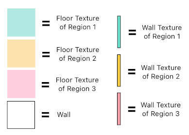
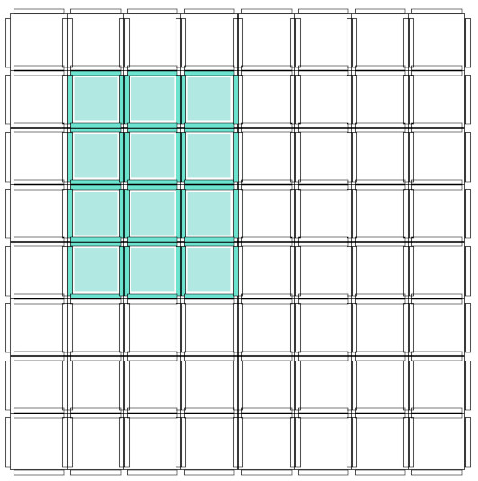
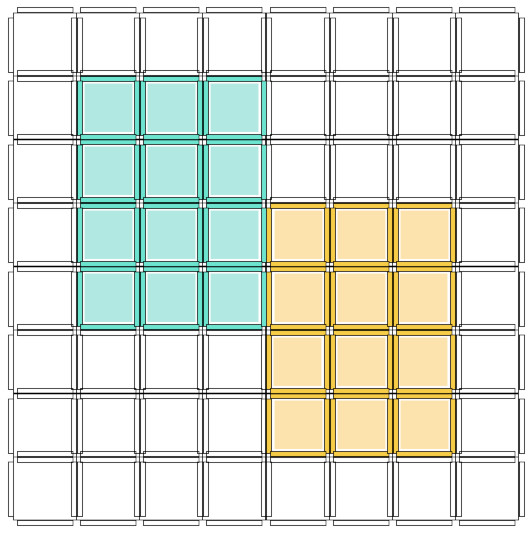
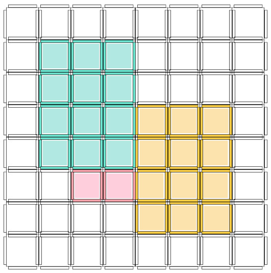
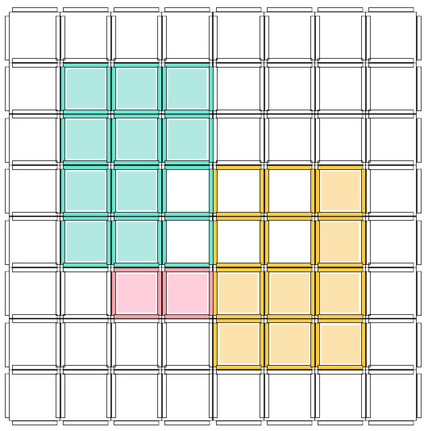
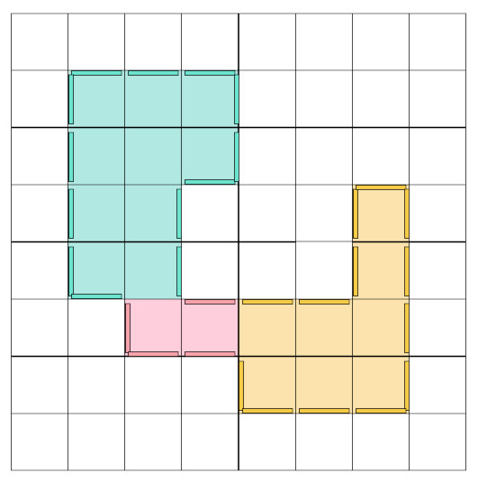

# Room Generation System

Reference: @src/shared/room/util/roomGenerationUtil.ts , @src/shared/room/util/roomGenerationHelperUtil.ts , @src/shared/room/util/proceduralRoomGenerationUtil.ts , @src/shared/room/util/roomGenerationLayoutUtil.ts , @src/shared/room/util/roomGenerationDecorUtil.ts , @src/shared/room/maps/roomGenerationPaletteMap.ts , @src/shared/room/types/roomGeneration/roomGenerationVoxel.ts , @src/shared/room/types/roomGeneration/roomGenerationVoxelGrid.ts , @src/shared/singlePlayer/maps/singlePlayerModeConfigMap.ts

## Overview

The room generation system lets us procedurally generate a room's content (i.e. `VoxelGrid` and `ObjectGroup`) without having to manually edit the individual voxels/objects by hand. Both multiplayer and singleplayer rooms are initially built by this system, via `RoomGenerationUtil`.

In case of multiplayer rooms, the system is also responsible for the room's boundary: it raises the perimeter walls and carves the doorway opening for the room's single entrance into one of them (see [room_entrance.md](room_entrance.md)).

Generation decides more than a room's contents: it also decides the room-level parameters those contents were picked to suit, and writes them onto the `Room` itself. See [Extending the System](#extending-the-system) for why that responsibility has to keep growing along with the rest of the game.

## Room Generation Grid

Although `RoomGenerationHelperUtil` provides us with a handful of useful methods to manipulate a room's content, they may still be too primitive for us to use when it comes to designing things on a larger scale, such as splitting the room into regions, establishing boundaries among them, and so on.

### Process

A `RoomGenerationVoxelGrid`, by default, is entirely filled with walls (No empty space). Therefore, we need to selectively carve out these walls, one rectangular region at a time. Each region has its own floor, ceiling, and surrounding wall textures. Once regions are allocated, we can then proceed to split these regions by creating walls between them. This whole process (i.e. Region creation -> Wall creation) is sufficient to let us partition our room into distinct regions (each of which is uniquely textured), which are separated by walls.

### Example

Here is an example which demonstrates how the preliminary room generation process of `RoomGenerationVoxelGrid` works.

#### Basic Setup

The following image shows a set of graphical elements which will be used to illustrate our example.

#### Steps

1. Create Region 1.

2. Create Region 2 that is adjacent to Region 1.

3. Create Region 3 that is adjacent to Region 1 and 2.

4. Create Walls to add some boundaries between the regions.

5. Finalize the `RoomGenerationVoxelGrid`. This produces the room's actual `VoxelGrid` from the current layout of regions and walls.

## Procedural Multiplayer Rooms

Every multiplayer room — Hub or Regular — is laid out procedurally when the server creates it, from a seed drawn at that moment, so that no two rooms open on the same interior. The seed itself is not kept: what it produced is saved as the room's ordinary content, and is edited from then on like any other room's.

`ProceduralRoomGenerationUtil` is the recipe. It decides what a multiplayer room is made of, and leaves the how to the parts below.

### Texture packs and palettes

A voxel texture index is a cell position within the room's texture pack atlas rather than a material, and each pack puts something entirely different at any given position. A set of textures is therefore only meaningful alongside the pack it was chosen against — which is why the room's texture pack is drawn as part of generating it, rather than being fixed beforehand.

`RoomGenerationPaletteMap` holds, per texture pack, a set of hand-picked `RoomGenerationPalette` combinations — a floor, a ceiling, a wall and an accent texture that read well together in that pack. Generation draws a pack together with its palettes, and from then on only ever assigns whole palettes, never individual textures. Drawing whole palettes is what makes each region look like a deliberately decorated space rather than a patchwork; drawing the pack is what stops every room in the game from opening on the same handful of materials.

A pack with no palettes picked for it is one that no room is ever generated in — the room's owner can still re-skin their room with it afterwards. So shipping a new texture pack means curating palettes for it as well, or it stays invisible to everyone but the owners who go looking for it.

### Floor plan

`RoomGenerationLayoutUtil` turns a bare area into a set of connected rooms:

1. The band of floor in front of the entrance is always kept as one undivided hall, so that what an arriving player sees is a room rather than the back of a wall.
2. Everything deeper into the room is cut recursively into rectangular areas — none narrower than a minimum, each separated from its sibling by a wall line one cell thick. A cut runs across the longer axis so that the areas stay roughly square; where the two axes are comparable, the seed picks.
3. Each area becomes a `RoomGenerationRegion`: a rect carved out of the generation grid and finished in its own palette. Since that grid starts out solid, carving the regions is what leaves the walls behind — every cell no region claimed simply stays solid, and the plan never has to draw a wall.
4. Every wall line is then opened up with one or more archways. Because the cuts form a tree of areas, a single opening per wall line is already enough to join all of them, so the whole room ends up walkable.

### Decoration

`RoomGenerationDecorUtil` furnishes the finished voxel grid:

- **Block work.** Each region gets one arrangement of decorative blocks picked by the seed — a colonnade flanking its central aisle, a low plinth at its centre, blocks in its corners — or is deliberately left bare, so that a room has open space in it as well as furnished space. Everything stands well inside its region, clear of the doorways.
- **Paintings.** `Canvas` objects are hung on the wall faces that are solid behind and open in front, at a standing player's eyeline and spaced out along each wall. They carry no source user: they belong to the room itself, the way a single-player room's fixtures do.

### The entrance

The stretch of floor the entrance opens onto is never built on and never hung with anything. That keeps an arriving player from being boxed in whichever way the rest of the room came out, and keeps generated content clear of the cells that room editing protects (see [room_entrance.md](room_entrance.md)). Laying out the floor plan raises the room's entire boundary, entrance cell included, so the doorway is re-opened once the plan is on the grid.

## Tutorial Room

Every first-time user automatically enters the "tutorial room" in order to participate in the tutorial. The initial construction of the tutorial room relies heavily on the room generation system (i.e. `RoomGenerationVoxelGrid` and `RoomGenerationHelperUtil`), and its dimensions are parameterized for easy adjustment. Because the tutorial room is a single-player room, this construction happens on the client (the server stores no copy of it — see [single_player_mode.md](../networking/single_player_mode.md)). The overall structure of the tutorial room is shown below.

A single-player room is a fixed, hand-authored template rather than a procedural one, so its `SinglePlayerModeConfig` *declares* the room-level parameters it is built with instead of drawing them. It still has to account for every one of them, for the same reason a procedural generator does.

## Extending the System

Room generation is the only thing that ever produces a room, which makes it the definition of what a complete room is. Whenever a new room-level parameter is introduced — the colour of a room's light, its skybox, its fog — or a new kind of object becomes placeable as a prop, generation has to be taught to decide or place it as part of the same change. Three things go wrong otherwise:

- **A parameter no generator sets is one that no room has.** Since every room comes out of generation, a parameter left out of it is one that every room in the game silently holds the default value of. However complete the editing UI for it is, the feature ends up visible only to the handful of owners who go and change it by hand.
- **A room's parameters are not independent of each other, or of its contents.** A palette only means anything alongside the texture pack it was picked against; fog has to agree with the skybox; a prop's materials have to come from the room's own pack. Generation is the single place those agreements are expressed, so a parameter introduced anywhere else produces rooms whose settings contradict their own contents.
- **Curated data has to cover everything that can be drawn.** Where a parameter has hand-picked content behind it — as texture packs have palettes — every option a room can be generated with needs that content, or generation has to leave the option out and the option effectively does not ship.

In practice this means the parameter is added to `Room` (so that it is stored and sent to clients), `RoomGenerationUtil` and `ProceduralRoomGenerationUtil` start deciding it, every `SinglePlayerModeConfig` declares its value, and any curated data behind it is extended to match.