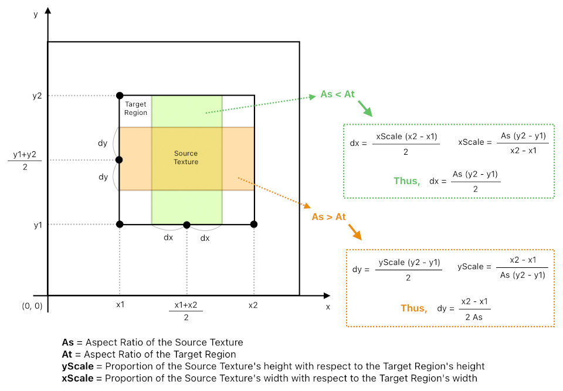

# Geometry of Textures

## Fitting a Texture inside a Rectangular Region

### Overview

When rendering a source texture onto a rectangular target region of a WebGL render target, we need to preserve the source's aspect ratio while fitting it entirely within the target bounds. This is achieved by comparing the two aspect ratios and shrinking the target quad along one axis so that it matches the source's proportions — a technique analogous to letterboxing (horizontal bars) or pillarboxing (vertical bars).

### Algorithm

1. **Convert UV coordinates to clip space.** The target region is specified in normalized UV coordinates (0 to 1). These are mapped to clip space (-1 to 1) via: `x = -1 + 2u`, `y = -1 + 2v`.

2. **Compute aspect ratios.**
   - `As` = source texture's aspect ratio (`sourceWidth / sourceHeight`).
   - `At` = target region's aspect ratio (`(x2 - x1) / (y2 - y1)`).

3. **Adjust the target quad based on aspect ratio comparison:**
   - **If `As < At`** (source is narrower than target): The target quad is too wide. Shrink its width to `As * targetHeight` and center it horizontally within the original region. This leaves empty vertical bars on the left and right (pillarboxing).
   - **If `As > At`** (source is wider than target): The target quad is too tall. Shrink its height to `targetWidth / As` and center it vertically within the original region. This leaves empty horizontal bars on the top and bottom (letterboxing).
   - **If `As == At`**: No adjustment needed — the texture fills the region exactly.

4. **Render the adjusted quad.** The source texture is drawn onto the resized quad via an orthographic full-screen pass, preserving the original aspect ratio.

### Place where this algorithm is being used
- `drawImageOnRenderTarget` function in @src/client/graphics/util/textureUtil.ts