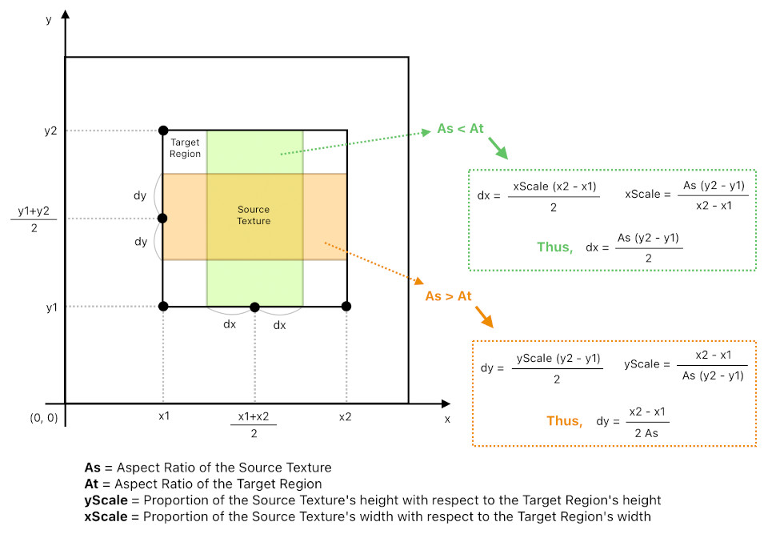

# Geometry of Textures

When a texture is drawn into a rectangular region, the region is shrunk along one axis to match the texture's aspect ratio and then centered, which letterboxes or pillarboxes the image. Implemented in @src/client/graphics/util/textureUtil.ts .
