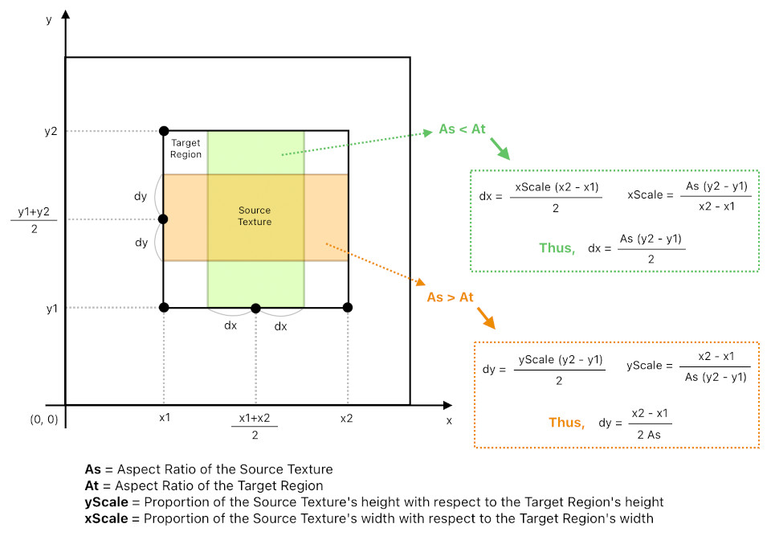

# Geometry of Textures

Pictures (canvases and props, one atlas between them) and labels draw what they show into a shared atlas (@src/client/graphics/types/texture/textureAtlas.ts): one region of whole cells per key, as large as the largest of its holders asks for, up to the atlas's own cap. The two differ only in parameters: the picture atlas caps a region at the size of the largest image that keeps its scale, and the label atlas has no cap.
- A region is drawn before its holders move onto it, so a resize never shows a blank; a draw that lands after its entry moved on is dropped.
- When the picture atlas is full, the largest regions are drawn smaller rather than anything being left out; the room's cap on pictures keeps that always possible.

Where content goes on the quad showing it is one layout (@src/client/graphics/util/textureAtlasLayoutUtil.ts), in three modes:
- **Fill** (labels): the quad covers its area.
- **Fit** (paintings): the quad is shrunk along one axis to the content's aspect ratio, as shown, and centered. The letterbox is the quad's shape, not transparent texels. Content within a small tolerance of the area's shape fills it.
- **Preserve** (everyday objects; see `ImageMetadata.preserveScale`): the content keeps its own world size. The quad is the smaller of the area and the content on each axis and samples the centred part, so whatever overflows is cut off. A prop showing such an image is exactly its size (see `ObjectScalingConfig.getFixedScale`).

A picture's image is one region per ImagePath, shared by every canvas or prop showing it (`PictureGameObject`): a fitted image's region follows the largest picture showing it (up to the cap), a preserved one is its own cells. QuarterTurns turns what the quad samples, in the shader, so a turn, a resize or a frame change moves texture coordinates and never redraws.

The picture material discards transparent texels, so a canvas's board, or the face behind a prop or a frameless canvas, shows through an image's own transparent pixels, e.g. an object cut out of its photo's background.
- A click and the look edit mode opens on go through them as well (`CameraUtil`): each asks what the picture draws at the point met (`InstancedMeshBinding`), which repeats the shader's mapping from the quad to the atlas and blends the texels there as the atlas's filter does.
- **Trap**: the atlas exists only on the GPU, so asking reads it back and waits for every draw before it. Only those one-off casts ask; a cast made every frame (sight checks, the orbit's occlusion sweep) takes a picture as solid all over.

## Voxel texture packs

Reference: @src/server/ssg/builder/voxelTexturePackBuilder.ts , @src/server/ssg/util/proceduralTextureUtil.ts , @src/server/ssg/data/proceduralVoxelTextures.ts , @src/client/object/types/gameObject/voxelGameObject.ts

A room's voxel quads all draw from one static atlas, its texture pack's: a grid of square cells, which a quad's texture index counts from the bottom-left.
- The lowest rows are the pack's own image. Above them are rows of **procedural** cells, the same in every pack (metals, raw and painted concrete). SSG draws those rows into a lossless image of their own beside the packs, attaches it to each pack's image, and writes the result as the pack's augmented copy, which is what the game loads (see [image_map.md](../graphics/image_map.md)). The pack's own image is never rewritten.
- A procedural texture is drawn from its spec and a seed alone, so every build writes the same pixels, and every pattern in it wraps at the edges it tiles at. Its detail is fine and spread evenly (a metal's shine is thin streaks, never a broad sheen), since anything broader shows as a pattern where the texture repeats. The list is append-only, since stored quads name their texture by index.
- An ordinary SSG run draws the rows only while their image is missing, and builds an atlas only when it is older than its pack's image or the rows. A full run (`MODE=ssg`) redoes both, so **a change to how the textures are drawn shows up only then**, or once the rows' image is deleted.
- The atlas is lossy, so color bleeds between neighbouring cells across their outermost texels. A procedural cell therefore tiles inside a **margin** of its own continuation (`PROCEDURAL_VOXEL_TEXTURE_MARGIN`), which quads and the selection menu's texture strip leave out, so a flat color shows no line where it repeats. A pack's own cells tile at their full size, and its top line of pixels is repeated into the margin above it, so its top cells keep the upper edge they have in its own image.
- A quad shows whole texels of what tiles in its cell, sampled from texel centre to texel centre so filtering never reads the next cell: all of it on a full face, and half on a wall layer, the halves alternating so two layers show the whole. A shrunk block's face shows the part of that which it covers of its cell, so faces side by side continue one texture.
