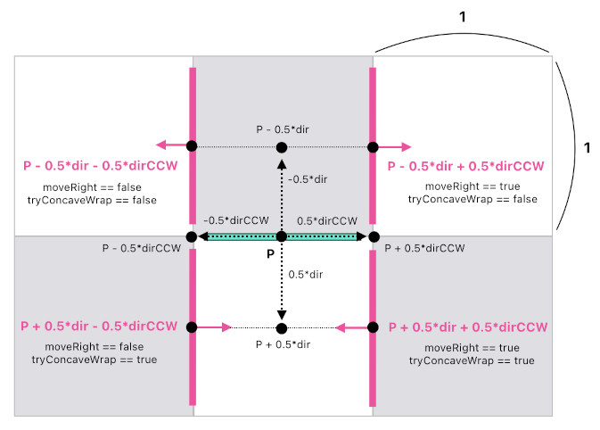
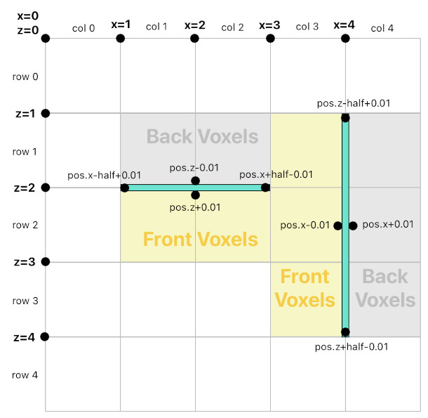

# Geometry of Wall-Attached Objects

A wall-attached object is a game object that is mounted on the surface of a voxel wall (e.g. a painting, shelf, or wall lamp). Its position snaps to a 0.5-unit grid, and its direction vector is always axis-aligned (one of `+x`, `-x`, `+z`, `-z`), pointing outward from the wall it is attached to.

## Position & Direction Quantization
All wall-attached object positions are quantized to the 0.5-unit grid: `0.5 × round(2 × pos_component)`. Direction components are rounded to integers (−1, 0, or 1). The quantized collider dimensions are: horizontal half-size = `0.5 × round(colliderConfig.hitboxSize.sizeX)`, vertical half-size = `0.5 × round(colliderConfig.hitboxSize.sizeY)`.

## Movement Types
Wall-attached objects support three movement types:
1. **Vertical movement**: Simple ±0.5 unit translation along the Y axis. Direction unchanged.
2. **Horizontal movement (same wall)**: Uses the perpendicular CCW rotation of the facing direction to compute the movement vector along the wall surface.
3. **Horizontal movement (corner wrap)**: When reaching a wall corner, the object wraps around it (see "Computing Corner-Wrapped Movement" below). The algorithm tries concave wrapping first and falls back to convex.

## Computing Corner-Wrapped Movement of a Wall-Attached Object

### Overview

When a wall-attached object slides horizontally along a wall and reaches a corner, it should seamlessly wrap around the corner rather than stopping or detaching. There are two types of corners to handle:

- **Concave corner** (inner corner): The wall turns inward. The object pivots around the inner edge and continues along the adjacent wall face.
- **Convex corner** (outer corner): The wall turns outward. The object pivots around the outer edge and continues along the adjacent wall face.

In both cases, the object's facing direction rotates 90 degrees and its position shifts to align with the new wall surface.

### Algorithm

1. **Quantize the object's transform.** Snap position to the nearest 0.5-unit grid point and round the direction to the nearest axis-aligned unit vector.

2. **Derive perpendicular directions.** Rotate the object's facing direction 90 degrees counter-clockwise (on the XZ plane) to obtain the sideways axis. This determines which direction counts as "left" vs "right" for the object.

3. **Compute the corner-wrapped position.** The new position is calculated by adding two offsets to the current position:
   - `offset1` = facing direction scaled by `halfHorizontal` (forward for concave wrap, backward for convex wrap).
   - `offset2` = sideways direction scaled by `halfHorizontal` (left or right depending on move direction).

   Here, `halfHorizontal` is half the object's quantized width along the wall surface.

4. **Compute the new facing direction.** The new direction is the sideways axis, potentially negated depending on the combination of wrap type (concave vs convex) and move direction (left vs right). This ensures the object always faces outward from its new wall.

5. **Validate placement.** The algorithm calls `canPlaceObject` to check that the new position is valid (backed by a wall, not out of bounds, not colliding with other objects). If invalid, `undefined` is returned.

The caller tries concave wrapping first, and falls back to convex wrapping if the concave attempt fails.

### Place where this algorithm is being used
- `getCornerWrappedHorizontalMoveResult` function in @src/shared/object/util/wallAttachedObjectUtil.ts

## Finding the Front/Back-Facing Voxels of a Wall-Attached Object

### Overview

A wall-attached object can only be placed at a position where (1) its back side is fully supported by solid voxel blocks and (2) its front side is at least partially exposed (not fully buried inside a wall). This is validated by querying the voxel grid along the object's back row/column and front row/column.

### Algorithm

1. **Determine the primary axis.** Based on the object's facing direction, determine whether it spans horizontally along the X-axis (when facing along Z) or the Z-axis (when facing along X).

2. **Identify back and front voxel rows/columns.** A small offset (0.01) in the facing direction is used to find:
   - The **back row/column**: the voxel cell directly behind the object (opposite to facing direction).
   - The **front row/column**: the voxel cell directly in front of the object (along the facing direction).

3. **Iterate across the object's width.** For each voxel column (or row) that the object spans:
   - **Back voxel check**: Query the voxel's collision layer mask and verify that it fully covers the object's vertical range (`objBottomY` to `objTopY`). The collision layer mask is a bitfield where each bit represents a 0.5-unit vertical slice. All bits within the object's Y-range must be set. If any back voxel fails this check, placement is rejected — the object would not be fully supported.
   - **Front voxel check**: Query the same collision layer mask for the front voxel. If at least one front voxel does *not* fully cover the object's Y-range, the object has some exposure (it is not completely embedded in a wall). If every front voxel fully covers the range, the object would be invisible, so placement is rejected.

4. **Collision check with other objects.** Finally, verify that the new position does not overlap with any existing wall-attached objects in 3D space.

### Place where this algorithm is being used
- `canPlaceObject` function in @src/shared/object/util/wallAttachedObjectUtil.ts