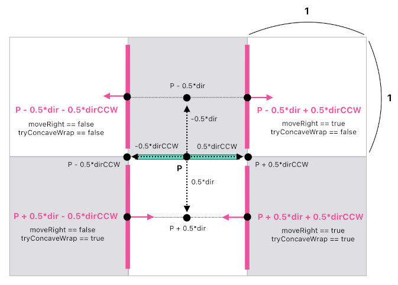
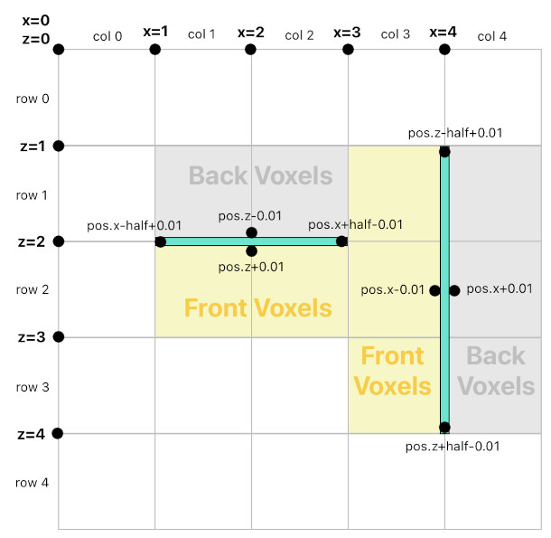

# Geometry of Wall-Attached Objects

A wall-attached object is a game object mounted on the surface of a voxel wall (e.g. a painting, or a [door](door_design.md)). Its position snaps to a regular sub-cell grid, and its facing direction is always axis-aligned, pointing outward from the wall it is attached to.

An attachment's collider is centred on its position, so one that stands on a floor rather than hanging at eye level has its origin half its own height above that floor. A door is the case that matters.

## Position & Direction Quantization
Wall-attached object transforms are quantized before use: positions snap to the nearest sub-cell grid point, facing directions round to the nearest axis-aligned unit vector, and the collider's footprint is sized to whole grid steps. This keeps these objects flush with the wall and aligned with the voxel structure behind them.

## Movement Types
Wall-attached objects support three movement types:
1. **Vertical movement** — a step up or down along the wall surface, with the facing direction unchanged.
2. **Horizontal movement (same wall)** — a step sideways along the wall surface, derived from a perpendicular rotation of the facing direction.
3. **Horizontal movement (corner wrap)** — when the object reaches a wall corner, it wraps around the corner onto the adjacent wall face instead of stopping or detaching (see below). The object tries a concave wrap first and falls back to a convex one.

## Computing Corner-Wrapped Movement of a Wall-Attached Object

### Overview

When a wall-attached object slides horizontally and reaches a corner, it should seamlessly wrap around the corner rather than stop or detach. There are two cases:

- **Concave corner** (inner corner): the wall turns inward. The object pivots around the inner edge and continues along the adjacent wall face.
- **Convex corner** (outer corner): the wall turns outward. The object pivots around the outer edge and continues along the adjacent wall face.

In both cases the object's facing direction rotates by a quarter turn and its position shifts to align with the new wall surface.

### Algorithm

1. **Quantize the object's transform.** Snap the position to the grid and round the facing direction to the nearest axis-aligned unit vector.

2. **Derive the sideways axis.** Rotate the facing direction a quarter turn on the XZ plane to obtain the object's sideways axis, which distinguishes a leftward move from a rightward one.

3. **Compute the wrapped position.** Offset the current position both along the facing axis (forward for a concave wrap, backward for a convex one) and along the sideways axis (toward the direction of travel), each by half the object's width along the wall.

4. **Compute the new facing direction.** The new facing is the sideways axis, flipped or not depending on the combination of wrap type (concave vs convex) and travel direction (left vs right), so the object always faces outward from its new wall.

5. **Validate placement.** Check that the resulting position is valid (backed by a wall, in bounds, and not colliding with other objects). If not, the wrap fails.

The caller tries a concave wrap first and falls back to a convex wrap if the concave attempt fails.

Implemented in @src/shared/object/util/wallAttachedObjectUtil.ts .

## Finding the Front/Back-Facing Voxels of a Wall-Attached Object

### Overview

A wall-attached object may only be placed where (1) its back is fully supported by solid voxel blocks and (2) its front is at least partially exposed (not entirely buried inside a wall). This is validated by querying the voxel grid along the object's back and front rows/columns.

### Algorithm

1. **Determine the primary axis.** From the object's facing direction, decide whether it spans along the X-axis or the Z-axis.

2. **Identify the back and front cells.** The cells directly behind (opposite the facing direction) and directly in front of the object.

3. **Iterate across the object's width.** For each cell the object spans:
   - **Back check** — the cell's collision layer mask must fully cover the object's vertical range; otherwise the object would not be supported, and placement is rejected.
   - **Front check** — at least one front cell must *not* fully cover that vertical range, so some of the object is exposed. If every front cell is solid across the range, the object would be invisible inside the wall, and placement is rejected.
   - **Protected-space check** — the stretch of wall the object would hang on must not reach into somewhere the room keeps clear of new block work, since hanging something there walls the space in exactly as a block would. What is asked about is that stretch alone — the one cell of wall, over the layers the object's own height covers — rather than the whole column of room behind it, so an attachment may go up on an upper storey standing over ground the room protects. See [room_entrance.md](room_entrance.md#editing-constraints-near-the-entrance).

4. **Collision check.** Finally, verify the new position does not overlap any existing wall-attached object.

Implemented in @src/shared/object/util/wallAttachedObjectUtil.ts .

## Removing the Wall Behind an Attachment

The support a placement requires can also be taken away afterwards, by removing the voxel block the object hangs on. So a block is asked what it is holding up before it may go: the attachments standing against it count, while ones merely overlapping it from the far side hang on some other block and do not. Removing such a block by itself is refused, since it would leave an attachment with no wall behind it. Removing it together with everything hanging on it is a request of its own — the editing UI warns that the attachments will be destroyed, and on the user's confirmation takes those down first and the block after them.
