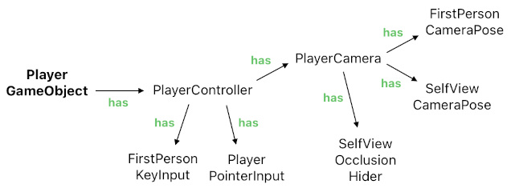

# Camera Control

Reference: @src/client/object/components/playerController.ts , @src/client/object/components/helpers/player/playerCamera.ts , @src/client/object/components/helpers/player/firstPersonCameraPose.ts , @src/client/object/components/helpers/player/selfViewCameraPose.ts , @src/client/object/components/helpers/player/selfViewOcclusionHider.ts , @src/client/object/components/helpers/player/playerPointerInput.ts

## Overview

The user's own player object carries the `PlayerController` component (only the user's own player is allowed to have it). It gathers the user's inputs, steers the player's movement, and drives the player camera through a set of helper modules:

- `PlayerPointerInput` — captures pointer activity on the game canvas, independently of the camera mode. It exposes the ongoing drag in two readings: a joystick-style offset from the press point (used for steering) and a grab-style per-frame delta (used by the self-view orbit). It also raycasts clicks into the scene to notify the clicked game object.
- `FirstPersonKeyInput` — turns the movement keys into smoothed steering input, accelerating toward the pressed direction, and ignoring keystrokes while a UI input element is focused.
- `PlayerCamera` — owns the camera itself (see below).

Each frame, the controller updates the input helpers before the camera, so the camera reacts to the same frame's drag.

## Steering

Steering input (pointer drag + keys) accumulates into a horizontal and a vertical component. In the first-person mode, the horizontal component yaws the player object around the vertical axis, while the vertical component pushes the player forward or backward along its facing direction — expressed as a desired velocity on the player's `Rigidbody`, so the physics engine resolves the actual motion. In the self-view mode the player stands still: the desired velocity is zeroed, and drag input orbits the camera instead.

## Camera Modes

The active mode is a `CameraMode` value published through `cameraModeObservable`:

- **"firstPerson"** — the default gameplay mode. The camera sits at the player's eye and looks where the player faces.
- **"selfView"** — an inspection mode in which the camera pulls up and out in front of the player and looks back at it, so the user can watch his/her own character. It is entered while the player-customization form is open, and returns to first-person when the form closes (see [player_customization.md](../geometry/player_customization.md)).

The user's own body is hidden in first-person mode (so it never clips the camera) and shown in self-view; `PlayerGameObject` listens to the same observable to toggle this visibility. (Other players' bodies are governed by proximity instead: a player who comes too close to the user is temporarily hidden so it does not clip through the camera.)

## PlayerCamera

`PlayerCamera` attaches the global camera to the player object, so the camera inherits the player's position and yaw automatically. Every frame it asks the active mode's pose helper for a desired pose (a position and rotation in the player's local frame) and eases the camera toward it. Because both modes feed the same interpolation, switching modes glides the camera from one framing to the other rather than snapping.

### First-Person Pose (`FirstPersonCameraPose`)

The camera rests at the player's eye level, and its pitch is the only degree of freedom, chosen automatically:

- **View target.** When the player has an active view target (published through `playerViewTargetPosObservable`, e.g. the position of a selected voxel-quad or object), the camera pitches up or down toward it, within a clamped range, so the target stays in focus. If the target remains outside the camera's view frustum for a short duration, the selection is automatically cleared so that the camera can recover its neutral pitch.
- **Altitude.** With no view target, the pitch follows the player's altitude: the higher the player stands above the floor, the more the camera tilts downward, giving an overview of the room; at ground level it looks straight ahead.

### Self-View Pose (`SelfViewCameraPose`)

The camera orbits around a pivot on the player's body, in the player's local frame. Grab-style pointer drags rotate the orbit angles 1:1 with the pointer's movement (like Three.js's OrbitControls), with the polar angle clamped away from the poles so the camera never ends up directly above or below the player. Each time the mode is entered, the orbit resets to a default framing — above, slightly off to the side, and out front of the player, looking back at the body.

### Clearing the Line of Sight (`SelfViewOcclusionHider`)

Since the orbit swings freely, the camera regularly ends up with a wall, the ceiling, a canvas, or another player between itself and the body it is framing — and the mode exists precisely so the user can see that body. So, while the self-view is active, whatever stands in the way is hidden until it no longer does. What has to be cleared is the *whole* body rather than a line to its middle: a wall block is a fraction of the body's height, so clearing only what a central ray crosses would leave most of the body behind the wall.

Occluders are therefore looked up against the body's box, and by two different means, because their costs are nothing alike:

- **The room's own geometry.** The body's box is swept toward the camera through the voxel grid, and every solid block it runs into is hidden, along with the room's floor and ceiling tiles when the orbit passes under or over them. Walking the grid answers the question directly and covers the body completely, where raycasting a room's worth of voxel quads would be both far slower and only ever as thorough as its samples. A block that is in the way is hidden whole, so the body is seen through a clean opening rather than through a single missing face.
- **Everything else.** Canvases, doors, and other players are found by raycasting the remaining meshes — few enough to raycast cheaply — along a grid of samples spread over the body's silhouette, dense enough that an object cannot sit unnoticed between two samples.

Both follow the eased camera, i.e. the one actually rendered, and are paced rather than run every frame — promptly once the camera has moved, slowly while it rests, which is when only a moving occluder could change the answer. The raycasting half shows what it hid before looking again, since a hidden instance is parked out of the room where no ray can reach it; the grid half needs no such thing, as the grid describes the room regardless of what is currently drawn.

Hiding an occluder is not simply a matter of switching a mesh off. Bodies, walls, and canvases are each drawn as instances of a shared instanced mesh, and a mesh's visibility governs its whole draw call — switching it off would take every other object drawn from it down as well. A single instance is therefore hidden by parking it out of the room, through `InstancedMeshBinding`, which holds on to the transforms its owner keeps baking meanwhile instead of drawing them. The owner runs its usual display/hide lifecycle throughout, unaware that anything is going on, and gets its instance back wherever it last asked for it. Whatever is hidden is shown again when the self-view mode is left, or when the player object goes away.
