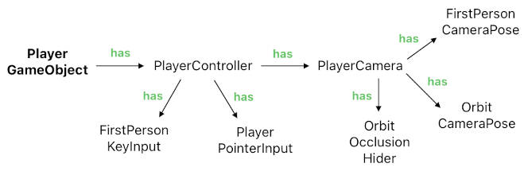

# Camera Control

Reference: @src/client/object/components/playerController.ts , @src/client/object/components/helpers/player/playerCamera.ts , @src/client/object/components/helpers/player/firstPersonCameraPose.ts , @src/client/object/components/helpers/player/orbitCameraPose.ts , @src/client/object/components/helpers/player/orbitOcclusionHider.ts , @src/client/object/components/helpers/player/playerPointerInput.ts , @src/client/object/components/helpers/player/pointer/pointerDragInput.ts , @src/client/object/components/helpers/player/pointer/pointerZoomInput.ts , @src/client/graphics/util/cameraUtil.ts

## Overview

The user's own player object carries the `PlayerController` component (only the user's own player is allowed to have it). It gathers the user's inputs, steers the player's movement, and drives the player camera through a set of helper modules:

- `PlayerPointerInput` — watches the game canvas for pointer activity, independently of the camera mode, and hands each event to the module that reads that kind of gesture (see below).
- `FirstPersonKeyInput` — turns the movement keys into smoothed steering input, accelerating toward the pressed direction, and ignoring keystrokes while a UI input element is focused.
- `PlayerCamera` — owns the camera itself (see below).

Each frame, the controller updates the input helpers before the camera, so the camera reacts to the same frame's drag.

### Pointer Gestures

The gestures a pointer can make on the canvas are not distinguishable event by event — a drag and a pinch are the same events until a second finger arrives, and a click is only a click by virtue of the drag that did not happen — so `PlayerPointerInput` listens in one place and holds the arbitration between them, while a module of its own holds the reading of each gesture that has something to accumulate over time:

- `PointerDragInput` — one pointer moving while held down. It exposes the drag in two readings, since the two things it drives want different ones: a joystick-style offset from the press point (used for steering), and a grab-style per-frame delta that follows the pointer 1:1 (used by the orbit). It also answers whether the gesture that has just ended stayed still enough to count as a tap rather than a drag, measured against the kind of pointer that made it — a finger is a far coarser pointer than a mouse, and holding it to a mouse's precision would make an ordinary tap read as a drag.
- `PointerZoomInput` — two fingers pinching, or the mouse wheel. Both are reported as one reading, since they mean the same thing. That reading is a *scale of what the user sees* rather than a change of camera distance: a pinch grabs the view and a view that is grabbed is expected to follow the fingers, and being a multiple also keeps a wheel notch meaning the same thing at every distance, where a fixed length added or subtracted would be a leap up close and imperceptible from far away.

A press and release that stayed in one place is a click, which needs no module of its own: there is no gesture to accumulate, only a single cast into the scene (see `CameraUtil`) that answers which game object was drawn under the pointer, so that object can be told it was clicked.

A second finger settles what a gesture is: the drag is given up on, since reading the same fingers as both a drag and a pinch would spin the view while it is being zoomed. Likewise, any finger leaving ends the drag rather than letting it carry on with whichever finger is left, which is nowhere near where the drag it would inherit began.

## Steering

Steering input (pointer drag + keys) accumulates into a horizontal and a vertical component. In the first-person mode, the horizontal component yaws the player object around the vertical axis, while the vertical component pushes the player forward or backward along its facing direction — expressed as a desired velocity on the player's `Rigidbody`, so the physics engine resolves the actual motion. In the orbit mode the player stands still: the desired velocity is zeroed, and drag input orbits the camera instead.

## Camera Modes

The active mode is a `CameraMode` value published through `cameraModeObservable`:

- **"firstPerson"** — the default gameplay mode. The camera sits at the player's eye and looks where the player faces.
- **"orbit"** — an inspection mode in which the camera pulls back from a target anywhere in the room and looks right at it, so the user can see it from any angle.

The mode carries its own target rather than having it published separately, so the camera can never be left orbiting around something other than what it was pointed at. The target is a *volume*, not a point: a point within it is what the camera orbits around, while its extent decides how far back the camera sits and how much of the room has to be cleared out of the way.

The user's own body — and the speech bubble hanging over it — is in view for as long as the camera is both pulled back from it and standing clear of it, which `PlayerGameObject` settles afresh each frame, the camera being free to move at any moment.

Pulled back is a matter of the mode. The first-person view keeps the camera at the character's own eye and never shows him; edit mode is what shows him, whatever is currently selected in it, since the character is one of the things the user came into that mode to work on and stays on show even while he works on something else.

Standing clear is a matter of distance, because an orbit is pointed at whatever is being edited rather than at the player, and can be drawn around to where the player happens to be standing. A camera that has come within the reach of the standing figure is inside the body rather than looking at it, and covers the view with the inside of it — which clearing the line of sight cannot help with, there being no line of sight left to clear. The orbit around the character himself is the exception, since coming in close to him is that view's whole point. Wherever the body merely gets between the camera and what is being framed, it is taken out of the way like anything else that does (see [Clearing the Line of Sight](#clearing-the-line-of-sight-orbitocclusionhider)). (Other players' bodies are governed by proximity instead: a player who comes too close to the user is temporarily hidden so it does not clip through the camera.)

### What puts the camera into an orbit

Which mode the camera is in is a consequence of which game mode the user is in (see [game_mode.md](../gameplay/game_mode.md)). In **play mode** the camera stays at the player's eye: selecting a voxel-quad or an object there pitches the camera toward it and brings up what it is, and nothing further. **Edit mode** is what gives the camera over to the selection, and it is the only thing that does.

While that mode lasts the camera orbits whatever is currently selected, and selecting something else moves the orbit onto it — a voxel-quad frames the whole block that quad belongs to (or the room's floor/ceiling tile, which belongs to no block), an object frames itself, and the user's own character frames its own body. `WorldSpaceSelectionUtil` decides that framing, reading the mode and the selection together, since one selection replacing another is two changes of which only the outcome matters. A selection dropped on the way to picking out another leaves the camera where it is: the gap belongs to the edit that is under way, not to the user.

One thing outranks the selection: a scripted tutorial step may hold the camera on a place of its own choosing until the step ends (see [single_player_mode.md](../networking/single_player_mode.md)). That is how such a step shows the user something he has not picked out yet — and could not pick out without first seeing it. A bare place has no extent to be framed by, so it is framed the way a selected block is, from far enough back to show what lies around it; a step that points the camera at a place and then asks the user to select what is there hands the orbit on without a jolt. Such a step may also ask for the view that place is to be seen from, rather than keeping the one the user left the camera in — a patch of floor seen from close to its own level is a sliver, whatever else it might be worth showing him from where he stood.

### How far the user can reach to select

A click only selects what it lands on if that is close enough to the camera, so that a click cannot pick out something across the room that the user can barely make out. Ordinarily this reach is an arm's length into the room, a fixed distance. But the orbit is the user's to move: he may take the camera right back to see what he is editing among its surroundings, and everything he has thereby brought into view is something he expects to be able to click. So while the camera orbits, the reach follows the distance the camera has been taken to, and whatever he can see he can select. `WorldSpaceSelectionUtil` decides this, and every object that can be selected asks it rather than measuring for itself.

Every volume the camera orbits is taken from the physics side, which is where the volume that every other system means by "this block", "this object", or "this character" is already defined.

## PlayerCamera

`PlayerCamera` attaches the global camera to the player object, so the camera inherits the player's position and yaw automatically. Every frame it asks the active mode's pose helper for a desired pose (a position and rotation in the player's frame) and eases the camera toward it. Because both modes feed the same interpolation, switching modes — and re-pointing the orbit at something else — glides the camera from one framing to the other rather than snapping.

### First-Person Pose (`FirstPersonCameraPose`)

The camera rests at the player's eye level, and its pitch is the only degree of freedom, chosen automatically:

- **View target.** When the player has an active view target (published through `playerViewTargetPosObservable`, e.g. the position of a selected voxel-quad or object), the camera pitches up or down toward it, within a clamped range, so the target stays in focus. If the target remains outside the camera's view frustum for a short duration, the selection is automatically cleared so that the camera can recover its neutral pitch.
- **Surroundings.** With no view target, the pitch follows the room the player is standing in: the further the open space he can see into falls away beneath his feet, the further down the camera tilts, so that a player who has climbed above the floor — up a staircase, onto a platform — is shown what is down there rather than the empty air ahead of him. `ClientVoxelQueryUtil` answers how far the room drops away (see [voxel_grid.md](../geometry/voxel_grid.md)); the camera only decides how far to pitch for it, and eases its way there, since what lies ahead can change entirely in a single step.

  The room is asked how far it falls below the level the player *stands* at, not below his eye, so what comes back is never a reason to tilt up. Open space above him is the ordinary case rather than anything to answer — it is what standing in any room with headroom to spare amounts to — and a camera that weighed it against the space below would answer for the height of the room instead of the lie of its ground, leaving the player to climb past the middle of the room before what lies beneath him counted for anything.

  Reading the room rather than the player's own altitude is what keeps this sensible in a room of more than one storey. A player who has walked upstairs stands far above the room's floor while the storey he is on lies flat around him, and has no more reason to look down than he had downstairs; how high he stands cannot tell those two cases apart, but what he can see into can.

### Orbit Pose (`OrbitCameraPose`)

The camera orbits around a point within the mode's target and looks at it. Grab-style pointer drags rotate the orbit angles 1:1 with the pointer's movement (like Three.js's OrbitControls), with the polar angle clamped away from the poles so the camera never ends up directly above or below the target. How far back it sits follows the target's own size, which is what lets the same orbit frame a whole character and a single block without either filling the screen or being lost in it.

That point sits a little above the target's center, by a share of the target's own height. What is worth looking at in something that stands upright — a character's face, the upper half of a door — is above its middle, and aiming dead center leaves it near the top edge of the view with empty floor beneath. Taking the offset as a share of the target's height rather than as a distance keeps the aim square on a block or a floor tile, which have next to no height to be off-center within.

Which way the target is currently viewed from is published in world terms (`orbitCameraAnglesObservable`), so that reading it is a way of knowing where the camera points. That is how a scripted tutorial step can note the view it found the user at and, later, tell that he has since moved the camera himself. World terms rather than terms relative to the player, so that the same angles frame the same thing however the user happened to be turned.

A view can also be *asked* for from outside, which is how such a step arranges the one it wants the user to begin from. It is a request rather than the angles simply being written, because pointing the camera at something frames it afresh from wherever the camera already stood, and a view written in the same breath as the thing to be looked at was chosen would be overwritten by that framing. The request is taken up immediately after it instead, so that naming a thing and saying how it is to be seen are one instruction.

That framing distance is a reference rather than where the camera actually ends up. A pinch or a wheel scales the view around the target, within a range on either side of the framing distance, so the user can lean in on a detail or pull back for the room around it. The zoom is expressed as a multiple of that distance rather than as a distance in its own right, which is what lets it mean the same thing whatever is being framed. It is published as a position within that range (`orbitCameraZoomObservable`), which is what lets the on-screen zoom slider — shown beside the mode's exit button for as long as the camera orbits — both show it and set it, so a pinch or a wheel notch moves the handle exactly as dragging it would. That position is logarithmic in distance, so a step of the slider means what a notch of the wheel means anywhere in the range.

An orbit *begins* at the distance the camera already stands at, not at the framing distance. Where the user stood when he pointed the camera at something is a view he chose — he walked up to the wall he is editing, or stayed back to take it in whole — and pulling him to a fixed distance from it throws that choice away and leaves him zooming back to where he already was. (A camera standing within the target's own footprint has no distance of its own to keep, any more than it has a direction to keep, and starts from the framing distance instead; that is the case when the orbit is around the user's own character.) From there the zoom is the user's, and it survives the orbit being pointed at something else, since how close he wants to look is a preference he expressed rather than a property of what he was looking at. Leaving the mode drops it: the next orbit begins from wherever he is standing then. Whatever the zoom is asked for, the camera stays within the range above and outside the target itself, from within which there would be nothing left to inspect.

Whoever points the camera may also ask for a minimum distance of its own, which is what selecting a block or an object does. Sizing the framing to the target answers "how big does this look", and that is the wrong question for a block or a picture being edited in place: what it is *part of* — the wall it belongs to, the room it stands in — is what the edit is judged against, and none of it is in view from arm's length. Framing a character is the opposite case, and asks for nothing beyond its size. Since the framing distance is what the zoom range is measured against, asking for a larger one also gives the user a longer leash on either side of it.

The light the room is lit by rides with the camera, so it follows the orbit out: its range grows with the distance the camera has been taken to, and its intensity grows with its range by exactly the falloff it decays by. It is eased on the same terms as the camera, since the pose is where the camera is *headed* — a light that answered the pose directly would light the target as if from the new distance while still standing at the old one, flaring on every notch of a zoom. A light sized for the player's own eye simply goes out past its range, which would leave a target the user has pulled back from lit by nothing but the ambient light; widening the range alone would only spread the same light more thinly. Between them, what is being framed stays as bright as it was from up close.

The orbit is described in world space, while the camera hangs off the player object — which is what makes the first-person view follow the player's eye for free. The orbit pose is therefore converted into the player's frame, the frame both modes are eased in, rather than the camera being taken off the player for the duration of the mode: expressing one pose in another frame costs a pair of conversions, whereas re-parenting mid-glide would split the easing across two frames of reference.

Each time the mode is entered, and each time it is pointed at something else, the camera keeps the direction it already views the new target from. Swinging around to a fixed side of the target instead would, for a target inside a wall, mean jumping to the far side of that wall. A camera that stands within the target's own footprint has no such direction to keep — which is the case when the user orbits his own body — and gets a default framing instead: behind the player and above him, looking the way he is facing. Over his shoulder rather than into his face, so that the room he was walking in is still the room in front of him when the orbit opens.

### Clearing the Line of Sight (`OrbitOcclusionHider`)

Since the orbit swings freely, the camera regularly ends up with a wall, the ceiling, or a canvas hanging on that wall between itself and what it is framing — and the mode exists precisely so the user can see that. So, while the orbit is active, whatever stands in the way is hidden until it no longer does.

What may be hidden at all is a matter each type of object declares for itself, by carrying an `OrbitOccluder` component. What carries it is the room's fabric — its walls, floor, and ceiling, the doors set into them, the pictures hanging on them — and taking a piece of that away reads as the room being opened up for the user, which is the whole of what the mode promises. A character carries no such declaration and is never taken out of the way, his own or anybody else's: he is somebody standing where he chose to stand, so removing him reads as the person having left rather than as the view having cleared, and the room gives way around him instead. Whether a character is on show is settled by rules of his own, which nothing here overrides. Geometry belonging to no object at all — a gizmo drawn over the room to point something out — declares nothing either, and is left alone for the opposite reason: it is not part of the room, so hiding it would take away a piece of guidance rather than open anything up.

Standing in the way is a matter of degree, however, and emptying something's place in the room is a heavy-handed answer to it: geometry that clips a corner of the target costs the user next to nothing, while geometry that covers the target costs him the whole point of the mode. The target is therefore reduced to a grid of sample points spread over its silhouette *as the camera sees it* — the whole target rather than a line to its middle, since a wall block is a fraction of a body's height and clearing only what a central ray crosses would leave most of the body behind the wall — and every candidate is judged by how many of those samples it stands in front of, i.e. by the share of the target it actually takes away.

That share only has to be a small one. It is measured against the whole target, so even a modest fraction of a standing character is a shoulder or a head, and a threshold generous enough to sound like a fair share leaves whole limbs of him behind the wall. Sparing a candidate also achieves less than it appears to: nothing is judged at all without already standing in front of the target, so what would be spared is never a block holding an intact wall together, only one at the rim of the opening being made anyway — and leaving it there does not keep the wall, it merely makes the opening the wrong shape around the thing the user asked to see. What keeps geometry that passes near the line of sight in its place is not the threshold but the samples themselves: they sit on the target's own surface, so something crossing none of them was never in the way of any part of it. The threshold is there for the narrower case of geometry that genuinely clips the target, but by so little that emptying its place in the room would be the greater loss.

Where those samples sit matters as much as how many of them there are. Each is placed where the camera's own ray toward it first meets the target, so that it stands on the target's surface with a clear line back. The aims those rays are given mark *directions* into the target rather than distances to it, and each ray is carried past its aim by the whole span of the target before it is asked what it first met: the aims are spread over a plane standing square to the camera, and half of that plane lies in front of the surface it speaks for — a camera looking down at a standing character sees its silhouette tilted, the top leaning away and the bottom leaning toward the camera, so an aim low on that silhouette is a point hanging in the air short of the character's chest. A ray stopping there would find nothing, and the target would end up sampled only over the part of it the aims happen to fall deep enough to reach — for anything taller than it is wide, its upper portion alone, and the opening cleared for it no larger than its head. Sampling the inside of the target instead would misjudge everything the target is embedded in: a selected block belongs to a wall and a picture hangs flat on one, so a point taken from within either lies behind that wall's face, and its line back to the camera runs away down the length of the wall — condemning block after block of it, none of which stands in front of anything the user could see.

A sample is dropped rather than counted when the face it landed on is walled off *for good*, and what settles that is not whether the room's geometry is pressed against the face but whether that geometry is one of the things staying put (see the exemption below). The sides of a block buried in a wall have the rest of that wall against them, and a picture fixed flat to a wall has the wall behind its back; both of those are staying whatever the camera does, so such a face stands for a part of the target nobody can ever be shown, and a line drawn from it back to the camera would carry off the wall it is buried in on behalf of something invisible. A character standing with his back to that same wall meets it exactly as flatly — but nothing about the wall is staying, since it is the very thing in his way and taking it away is what the mode is for, so his back counts and says so. How much of the target counts as "enough" is measured against however many samples survive, so it stays a share of what is actually on view.

Candidates are gathered by two different means, because their costs are nothing alike:

- **The room's own geometry.** The target's box is first swept toward the camera through the voxel grid, which settles almost all of a room's worth of voxel quads in one cheap test each — far too many to raycast repeatedly — and only the solid blocks and floor/ceiling tiles that survive that pass are measured against the samples. A block found to be in the way is hidden whole, so the target is seen through a clean opening rather than through a single missing face.
- **Everything else.** Canvases and doors are found by raycasting the remaining meshes — few enough to raycast cheaply — along the samples themselves. What a ray strikes counts against the whole object it belongs to rather than the piece struck: an object composed of several parts covers the target with all of them together, so taking away only the part a sample happened to land on would leave the rest of it standing in front of the target.

Whatever the orbit is looking *at* is exempt from both, and how far that exemption reaches depends on what the target is. A target that is itself a piece of the room's geometry — a selected face, which is a block — is rarely alone where it stands: the wall it belongs to is made of the blocks around it, and a picture hanging there rests against the same wall, so such a target is spared its whole neighbourhood of blocks along with anything reaching into it. A target that merely stands in the room — a character, a prop, a place a scripted step is pointing at — is spared nothing beyond the space it occupies itself. Sparing its surroundings as well would empty the mode of its point, since nothing can stand between the camera and the target without being nearer to the target than the camera is: a neighbourhood spared for its nearness takes in every occluder there is as soon as the user draws the camera in, and holds the wall in front of his own character in place at exactly the range he most wants to see past it. Whatever such a target is set *into*, if anything, is kept by its samples instead, which is a matter of the target's own surface rather than of distance.

Both means follow the eased camera, i.e. the one actually rendered, and are paced rather than run every frame — promptly once the camera has moved, slowly while it rests, which is when only a moving occluder could change the answer. The raycasting half shows what it hid before looking again, since a hidden instance is parked out of the room where no ray can reach it; the grid half needs no such thing, as the grid describes the room regardless of what is currently drawn.

Hiding an occluder is not simply a matter of switching a mesh off. Bodies, walls, and canvases are each drawn as instances of a shared instanced mesh, and a mesh's visibility governs its whole draw call — switching it off would take every other object drawn from it down as well. A single instance is therefore hidden by parking it out of the room, through `InstancedMeshBinding`, which holds on to the transforms its owner keeps baking meanwhile instead of drawing them. The owner runs its usual display/hide lifecycle throughout, unaware that anything is going on, and gets its instance back wherever it last asked for it. Whatever is hidden is shown again when the orbit mode is left, or when the player object goes away.
