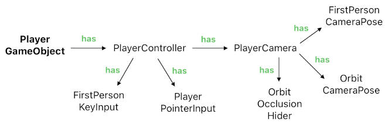

# Camera Control

Reference: @src/client/object/components/playerController.ts , @src/client/object/components/helpers/player/playerCamera.ts , @src/client/object/components/helpers/player/firstPersonCameraPose.ts , @src/client/object/components/helpers/player/orbitCameraPose.ts , @src/client/object/components/helpers/player/orbitOcclusionHider.ts , @src/client/object/components/helpers/player/playerPointerInput.ts , @src/client/graphics/util/gizmoDragUtil.ts , @src/client/graphics/util/worldSpaceSelectionUtil.ts , @src/client/ui/util/scrollAreaUtil.ts

Only the user's own player has a `PlayerController`. It reads input, steers the player's `Rigidbody`, and drives `PlayerCamera`. The camera updates in the components' late pass, after this frame's input and physics.

## Input
- `PlayerPointerInput` arbitrates pointer gestures. Presses are the canvas's; the wheel and a pinch's fingers are heard page-wide:
  - Gizmo drags (`GizmoDragUtil`): every press is offered to the registered drag sources first (e.g. the selected attached object's outline). A press one takes never reaches the camera or reads as a click; it becomes a drag only past the tap tolerance, and is cancelled otherwise. Hovering shows the cursor of what a press would take.
  - `PointerDragInput`: one held pointer. It exposes a joystick offset (for steering) and a 1:1 per-frame delta (for orbiting). Its tap-versus-drag tolerance depends on the pointer type.
  - `PointerZoomInput`: pinch or mouse wheel, reported as a **scale factor** rather than a distance. The pinch is read from touch events, which go on once the browser scrolls by a finger (its pointer events end there).
  - **Over the 2D UI**: in edit mode a wheel roll or a pinch's finger that lands on the UI counts as on the canvas, except under a popup (`numOpenPopupsObservable`) or the loading indicator. A scrollable area under the pointer keeps the wheel (`ScrollAreaUtil`), though not a trackpad's pinch; a pinch's moves are kept from the browser, so nothing scrolls under it. The UI root wears `yj-no-page-zoom` throughout edit mode, so the browser never zooms the page by a pinch there.
  - Click: a press that did not move, raycast through `CameraUtil` to find the clicked object. In play mode, where it hit a voxel quad or object is also handed to the camera for the next frame.
  - A second finger that counts toward a pinch cancels the drag, and any finger lifting ends it.
- A wheel rolled up or down over a strip that only scrolls sideways scrolls it, in either mode and inside popups (`ScrollAreaUtil`); where something around the pointer scrolls up and down, the roll is the browser's.
- `FirstPersonKeyInput`: smoothed movement keys, ignored while a UI input has focus. In edit mode a press of one steps the selection instead (see [game_mode.md](../gameplay/game_mode.md#selection)).
- **Steering**: in first person, horizontal input yaws the player and vertical input sets forward velocity. In orbit, the player stands still and a drag orbits the camera.

## Camera modes
`cameraModeObservable` publishes a `CameraMode`:
- **firstPerson** (play mode): the camera sits at eye level.
- **orbit** (edit mode): the camera orbits a **target volume** (not a point) that travels with the mode. The volume's extent sets the framing distance and what must be cleared from view. Target volumes come from the physics colliders.

`WorldSpaceSelectionUtil` points the orbit at the current selection. A voxel quad frames its block, and an object frames itself; the target follows the object's live position, so the orbit moves with it. While a gizmo drag moves or resizes the selection, the target is held as a copy, so the view stays still under the pointer, and it is traded back for the live one on release. A selection dropped mid-edit leaves the camera where it is. A single-player step can override the target, request view angles, or zoom the camera into a distance range that holds for every point of the target at any angle.

While the pointer that drags a selection by its inside is within a margin of the view's edge, or past it, the view follows the pointer (`SelectionEditGizmoUtil`), so there is more of the room to carry the selection on into. The margin is wider at the side edges, a share of the view's width, than at the top and bottom:
- the held copy slides toward the place in the room the pointer is over, whether or not the selection can go there. The pace grows with how far into the margin the pointer is and is measured against the camera's distance, so it looks the same at any zoom. Out of the margin, the view is still again;
- it goes only the way of the edge the pointer is at: across the view for a side edge, up or down the room for the top or bottom one, and toward or away from the camera for either. So a pointer held still at a side edge never lifts the view;
- once the selection has turned onto a face that looks another way, the orbit turns meanwhile, the shortest way round, until it sees that face from within a set angle of head-on. A selection that keeps its facing leaves the angles as the user set them;
- the drag is handed the pointer again as the view moves under it, which keeps the selection under the pointer;
- the view is the canvas less what the 2D UI stands over along its bottom (`bottomUIHeightObservable`), and a pointer over that UI counts as past the edge;
- a handle's drag is followed by nothing, nor is the view moved off a target a single-player step set.

Selection reach is a fixed arm's length in first person. While orbiting, it extends to the camera's distance, so anything visible can be selected.

The user's own body is shown only in orbit mode when the camera is not inside it, and never while a single-player step hides it. Hidden parts are parked out of the room, so raycasts pass through them. Other players are hidden while they are too close to the camera.

## PlayerCamera
The camera is parented to the player object. Each frame, the active pose helper supplies a target pose in the player's frame and the camera eases toward it, so mode and target changes glide rather than snap.

- **`FirstPersonCameraPose`**: pitch is the only freedom. It tilts down according to how far the visible room ahead drops below the player's standing level (`ClientVoxelQueryUtil`). Open space overhead is ignored, so storeys behave the same as the ground floor. While falling (nothing solid under the feet within a gap deeper than a stair, probed through the physics colliders), it holds the steepest downward pitch the room ahead can give instead, since the drop ahead shrinks on the way down and would lift the gaze. After landing, the gaze rises back from wherever the camera got to at a slower rate than it looks down; only rising is slowed, so a drop ahead can still pull it down straight away. A play-mode click on a voxel quad or object takes over from the room: the pitch follows the line of sight to the hit point (short of vertical), which brings it level with the middle of the view while the player faces it. The look lasts while the player walks slowly, judged by their own steering (a push or a step climbed doesn't count, and turning in place keeps it), and ends for good on a brisker walk, a fall, or the camera leaving first person. Turning into the look, and back out once it ends, runs through a slower easing of its own that the camera then follows, so each turn sets off gently rather than at full speed.
- **Trailing physics**: in first person, the part of each move that physics made rather than the steering (a step climbed, a drop, a push; reported by `Rigidbody`) is trailed on a critically damped spring, outside the pose easing. Steering is followed exactly, so walking never lags, and so is a move held back by a wall or a crowd, so the camera never goes where the body couldn't.
- **`OrbitCameraPose`**:
  - The drag maps 1:1 to orbit angles, with the polar angle clamped away from the poles. The aim point sits slightly above the target's center, by a share of its height.
  - The framing distance scales with the target's size, and a selection can require a minimum distance (a block or wall object is framed with its surroundings). Zoom is a multiple of the framing distance, published logarithmically through `orbitCameraZoomObservable` for the zoom slider, whose middle is the framing distance. The range covers edit mode's opening reach (see [game_mode.md](../gameplay/game_mode.md)), so an orbit can start from there without moving the camera.
  - Zooming in stops a small clearance short of the target's side facing the camera (its extent along the view, not its bounding sphere), so the camera comes right up to tall or wide targets without clipping them.
  - An orbit starts at the camera's **current** distance and direction, unless the camera is inside the target's footprint (e.g. orbiting the user's own body), in which case it uses an over-the-shoulder default. Zoom persists across targets and resets when edit mode ends.
  - A new target is looked at from where the camera stands. One stepped to by a movement key keeps the orbit's angles instead (`orbitCameraAngleHoldRequestObservable`), so the camera slides alongside rather than seeing a wall ever more aslant: any face, and an object facing the same way as the one left. No step turns the camera, so a face it would then see from behind is never stepped onto (see [game_mode.md](../gameplay/game_mode.md#selection)). Such a step undone or redone slides the same way, back or on again (see [game_mode.md](../gameplay/game_mode.md#undo-and-redo)).
  - Angles are published in world terms (`orbitCameraAnglesObservable`). A requested view is applied right after the target is framed.
  - The orbit is computed in world space and converted into the player's frame, which avoids re-parenting mid-glide.
- The head light stands at a point on the view axis, at most a fixed distance in front of the eased camera: the camera itself up close, otherwise a stand-in for a player standing near the subject. The fog is measured from there too, and so is the room light the head light yields to. Nothing about them grows with the camera's distance, and the far plane is fixed wide enough for the whole room from any orbit (`GraphicsManager`).

## Clearing the view (`OrbitOcclusionHider`)
While orbiting, whatever stands in the camera's view of the target is hidden: what reaches into the cone of sight, and what blocks the target itself.
- **What can be hidden**: objects with an `OrbitOccluder` component (walls, floor, ceiling, doors, pictures) and voxel blocks. Characters and gizmos are never hidden.
- **Cone of sight**: its tip is the orbit's pivot and its base is at the camera, and it widens on the way by `ORBIT_SIGHT_CONE_RADIUS_PER_DISTANCE`. So the opening is narrow by the target and wide by the camera.
  - The plane of the target's face it leaves through bounds it. A selected face's own wall or floor, which runs on toward the camera with the pivot inside it, is therefore never taken.
  - The room's own floor and ceiling are taken only from beyond them, since from inside nothing lies behind a tile. A target that is such a tile keeps its floor or ceiling from either side, and the blocks standing over it and against its sides.
- **Sampling**: the target is covered by a grid of sample points on its surface as the camera sees it. Each ray is pushed past its aim point to land on the target's surface. Samples on faces that are permanently walled in (a buried block side, the back of a picture, a floor tile under a block standing on it) are dropped. A candidate that blocks more than a small share of the surviving samples is hidden too, which keeps the whole target in view where it is wider than the cone.
- **Candidates**: voxels are found by sweeping the target's box toward the camera through the grid and by the cone, and a block in the way is hidden whole. Other meshes are raycast along the samples and tested against the cone by their colliders, and either hides the entire object. An attached object goes only along with a block it rests on, so nothing leaves a wall that is left standing.
- **Exemptions**: a voxel target spares its neighboring blocks and anything attached to them. Any other target spares only its own volume.
- Checks follow the eased camera and are throttled (frequent while moving, rare at rest). The speech bubble of the framed character trusts this result instead of running its own occlusion test.
- **Hiding** parks individual instances through `InstancedMeshBinding` (see [instanced_mesh_composition.md](instanced_mesh_composition.md)). Everything is restored when the orbit ends or the player object is removed.
