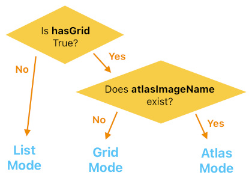
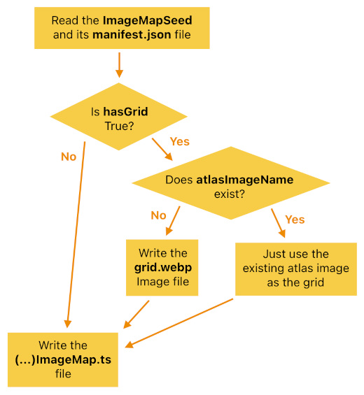

# Image Map System

Reference: @src/shared/graphics/image/types/imageMap.ts , @src/server/ssg/builder/imageMapBuilder.ts , @src/shared/graphics/image/types/imageMapSeed.ts , @src/client/ui/components/form/imageListChooserForm.tsx , @src/client/ui/components/form/imageGridChooserForm.tsx , @src/client/ui/util/imageListChooserUtil.ts

## Overview

An `ImageMap` is a catalog of a related set of image assets (e.g. canvas artwork, voxel texture packs, picture frames), letting the app refer to any of them by a short, stable string instead of a URL.

Each set of images lives in its own root directory under the app's assets URL, along with a hand-authored `manifest.json` that lists the images and their metadata. At build time, the static site generator hands each root directory to `ImageMapBuilder`, which composes any auxiliary image needed for browsing and emits an auto-generated TypeScript module for that map. Both the client and the server import those generated modules at startup, so every map is registered in `ImageMapUtil` and can be fetched by name from anywhere.

This arrangement gives us three things:

- **Compact references.** Gameplay data (object metadata, room settings, DB records) stores only an image path, and the server can validate that path against the same map the client used.
- **No runtime catalog fetch.** Image metadata ships with the bundle, so the chooser UI can list, search, and paginate images without any network round trip.
- **Cheap browsing.** Maps meant to be browsed as thumbnails carry a single pre-composed grid image, instead of forcing the UI to request every image separately.

## Terminologies

- `imagePath` - Relative path of the image file under the root directory (`public/app/assets/{rootDirName}`), but excluding the file extension (This is the same thing as the `path` field in @src/shared/graphics/image/types/imageMetadata.ts )
- `imageCoords` - Position of an image within its grid, written as `{subfolderName},{col},{row}` (the subfolder name is empty if the root directory has no subfolders). Only maps that have a grid carry coords.
- `imageMetadata` - The per-image record held by a map: its path, author, title, and (where applicable) coords. The path/author/title come straight from the manifest; the coords are assigned by the builder.
- `manifest` - The hand-authored JSON file at the root of an image directory, listing every image belonging to that map together with its author and title. It is the single source of truth about *which* images exist.
- `seed` - The `ImageMapSeed` describing how one map should be built: which root directory to read, what to name the generated map, and whether/how it has a grid.
- `subfolder` - An optional first path segment shared by a group of images. Each subfolder forms its own grid and appears as a separate tab in the grid chooser.
- `grid image` - A single image in which all of a subfolder's images are laid out as uniformly sized cells, used by the chooser UI to display many thumbnails at once.

## Types of Image Map

Which mode a map falls into is decided entirely by its seed:

- `List Mode` - The map has no grid, and its images are simply separate files under the root directory. Suited to large collections of visually distinct images with meaningful titles and authors, which the user browses as a searchable list (e.g. canvas artwork).
- `Grid Mode` - The map has a grid, which the builder composes itself: every image is resized to the map's uniform cell size and placed into a grid image, wrapping to a new row once the column limit is reached. Suited to small sets browsed as thumbnails (e.g. voxel texture packs).
- `Atlas Mode` - The map has a grid, but that grid already exists as a pre-composed atlas image. Here the individual images are not separate files at all — they are cells of the atlas, and each manifest entry's path *is* its `{col},{row}` cell coordinates (e.g. picture frames, which are also sampled from the same atlas at render time).

## Image Map Builder

`ImageMapBuilder` runs once per seed as part of the static site generation step. It reads the manifest, groups the listed images by subfolder, and then — depending on the map's mode — either composes a grid image, adopts the existing atlas as the grid, or skips grid handling altogether. Along the way it assigns each image its coords and, in atlas mode, validates that every declared cell actually falls inside the atlas.

Finally, the builder writes out an auto-generated module that constructs the `ImageMap` and registers it in `ImageMapUtil` under the map's name. The generated modules are pulled in by a single dependency module that both the client and the server entrypoints import, so all maps are available as soon as either app starts.

Because the generated files are derived artifacts, they must never be edited by hand — adding or removing an image means editing the manifest (and the image files themselves) and re-running the generator.

## Image Chooser UI

`ImageChooser` is a button that opens a chooser popup. Its props name the map to browse, the view type to use, the currently chosen path, and a callback that receives the newly chosen path. The two view types map onto the two shapes an `ImageMap` can take:

- **List view** (`ImageListChooserForm`) - Renders one row per image, each showing the image itself alongside its title and author. A search box filters the rows by title or author. The full list is shuffled once when the form opens, with the current choice pulled to the top, so that repeat visitors are exposed to different images rather than the same leading ones. Rows are mounted incrementally as the user scrolls to the bottom (see `ImageListChooserUtil`), since a map may hold far more images than are worth rendering — and requesting thumbnails for — up front.
- **Grid view** (`ImageGridChooserForm`) - Resolves the current choice into coords, then displays the corresponding subfolder's grid image as a selectable grid of cells, using the cell size and grid dimensions recorded in the map. Maps with named subfolders also get a tab bar for switching between them.

Either way, the user's selection is handed back to the caller as an `imagePath`, which is what ultimately gets stored (e.g. in a canvas object's metadata or a room's settings) and re-validated against the same map on the server.

## Related docs

- [Instanced Mesh Composition System](instanced_mesh_composition.md)
- [Texture](../geometry/texture.md)
