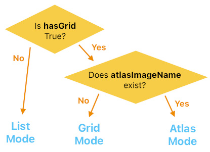
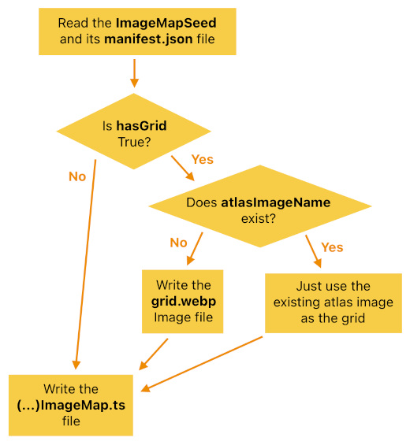

# Image Map System

Reference: @src/shared/graphics/image/types/imageMap.ts , @src/shared/graphics/image/types/imageMapSeed.ts , @src/server/ssg/builder/imageMapBuilder.ts , @src/client/ui/components/form/imageListChooserForm.tsx , @src/client/ui/components/form/imageGridChooserForm.tsx

An `ImageMap` catalogs a set of related images (canvas artwork, voxel texture packs, picture frames) so the app can refer to each one by a short, stable `imagePath` instead of a URL.

- Each map has a root directory under `public/app/assets/` with a hand-written `manifest.json` that lists every image with its author and title. The manifest is the source of truth.
- During SSG, `ImageMapBuilder` processes each `ImageMapSeed`. It writes auxiliary images (grid images, thumbnails) and generates a TypeScript module that registers the map in `ImageMapUtil`. The client and the server both import the generated modules. **Never edit generated files**; edit the manifest and rerun the generator instead.
- Benefits: stored data holds only paths, which the server validates against the same map; the catalog ships in the bundle, so no runtime fetch is needed; browsing uses one grid image; and thumbnails avoid downloading and uploading full-size images that are drawn small.

## Terms
- `imagePath` (`ImageMetadata.path`): the image's path under the root, without extension.
- `coords`: `{subfolder},{col},{row}` within a grid (only in gridded maps).
- `subfolder`: an optional first path segment. Each subfolder is its own grid and chooser tab.
- `thumbnail`: a downscaled copy sized to the largest the image is ever shown, e.g. a canvas's cell in the room's shared canvas texture.

## Modes
The seed determines the mode.

- **List**: separate files, browsed as a searchable list (canvas artwork).
- **Grid**: separate files that the builder composes into a uniform grid image (texture packs).
- **Atlas**: a pre-composed atlas. Manifest paths are cell coordinates, and the builder validates that they fall inside the atlas (picture frames). Atlas maps get no thumbnails.

## Chooser UI
`ImageChooser` opens one of two forms and returns the chosen `imagePath`:
- `ImageListChooserForm`: rows with thumbnail, title and author, plus search. The list is shuffled with the current choice pinned first, and rows mount incrementally (`ImageListChooserUtil`).
- `ImageGridChooserForm`: the subfolder's grid image as selectable cells, with tabs for named subfolders.
