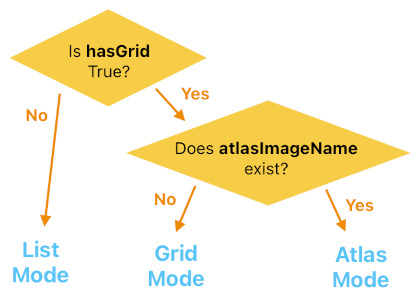
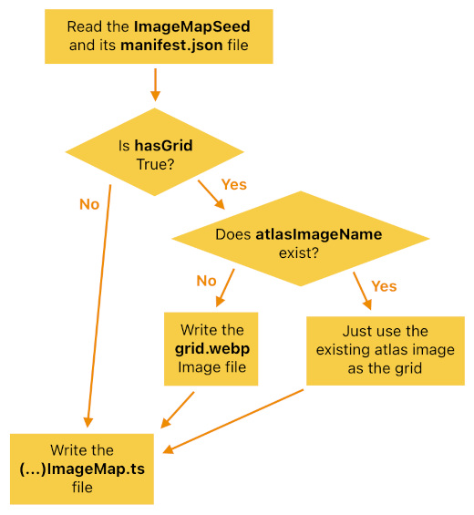

# Image Map System

Reference: @src/shared/graphics/image/types/imageMap.ts , @src/shared/graphics/image/types/imageMapSeed.ts , @src/shared/graphics/image/types/imageMapSettings.ts , @src/shared/system/types/adminAssetSettings.ts , @src/server/ssg/builder/imageMapBuilder.ts , @src/client/ui/components/panel/imageMapThumbnailPanel.tsx , @src/client/ui/components/form/imageGridChooserForm.tsx , @dev/scripts/imageMapEditor

An `ImageMap` catalogs a set of related images (pictures, voxel texture packs) so the app can refer to each one by a short, stable `imagePath` instead of a URL.

- Each map has a root directory under `public/app/assets/` with a `manifest.json` that lists every image with its author and title (and, for a third party's image, its source and license), which serve the notices and never ship, and optionally its keywords. The manifest is the source of truth.
- **Keywords** are what a search finds an image by, and all the built map carries of its description, as one comma-separated string (smaller to ship than a list). An image that names none is found by its title and author instead: so is every painting, while an everyday object names its own, as single words with none inside another (which a search would find anyway) and no grammatical words (which a search passes over); the editor tidies them so on saving, keeping their order. In the built map they follow the image's categories (see below).
- **Categories**: a subfolder's images are browsed by categories, each a name and a title (`ImageMapCategory`; the picture map's Objects are sorted by the kind of place they belong in: rooms of a home, commercial and industrial places; and accessories, the small things worn, carried or held). Which categories a subfolder has, and which of them an image is filed under, are the admin's to set, in the game (see Chooser UI), and are kept in the admin's settings (below), never in the manifest: the builder gives each subfolder's tab its categories in the order listed, and puts an image's own ahead of its keywords, each with the mark `ImageMap.CATEGORY_MARK` (`kitchen*`), the first being the tab a chooser opens on for it. It refuses categories listed in the manifest, and it and the editor a manifest keyword carrying the mark. Unmarked, a category's name is an ordinary word. An image under none is browsed under Misc. Categories only file images under tabs; they set no order. A name is one lowercase word, inside no other, and not a tab the chooser adds itself (`ImageMap.ALL_TAB`, `ImageMap.MISC_TAB`); the builder and the game check all three by one rule (`ImageMapSettingsUtil`).
- **Admin's settings**: `AdminAssetSettings`, the file `ADMIN_ASSET_SETTINGS_FILE_NAME` at the assets' root, holds what an admin sets by hand in the game, a part for each image map under its module's name (`ImageMapSettings`): each subfolder's categories, the order of its images and the categories of each image, every image named by the number its path ends in. It is written by the game (see Chooser UI), which knows only the images built into it: what the file says of a disabled image is gone from the next one saved. The builder and the game, taking a saved file back, hold it to one rule (`ImageMapSettingsUtil`).
- The picture map holds what canvases and props show, a subfolder each: paintings (Arts), which a canvas fits to its size, and everyday objects (Objects), which a prop shows at their own size. Each type accepts only its own subfolder's paths (`CANVAS_IMAGE_SUBFOLDER`, `PROP_IMAGE_SUBFOLDER`), as does its chooser.
- The picture map is edited with `npm run imageMapEditor` (see [local_dev.md](../devOps/local_dev.md)): samples of photos in its source library, straightened, turned by any angle, retouched, cut out (background fill, hand edits, and selections, each turnable, outside which, or inside which for one set to, everything is taken out or filled with a color) and color-adjusted, become entries. It writes each entry's image (the sample fitted whole into its cells, or stretched to fill them if asked, and placed as aligned, smaller for a margin if asked, the rest its edge color or see-through; or, for a painting, the sample at a long side), a full-resolution sample (`dev/assets/`, never shipped, to make the entry again at another size), the manifest, its recipes, the notices' table of third-party images, and rebuilds the map.
- Every entry, in any tab, is edited the same way, from its recipe. One without a recipe (added to the manifest by hand) is taken in when the editor starts, as the whole of its own image, which becomes its source and its sample unchanged.
- Photos can also be sampled in batches from the command line (sources added by address or from files, surveyed with a grid, and a plan of samples saved), which the `image-map-sampling` skill drives. A file is added as ThingsPool's own picture, naming its author alone, or with the address, author and license of the photo it was made from. A batch's entries are always saved disabled, to be reviewed.
- The source library keeps each photo by its content hash, which recipes name; the photos are gitignored, and a committed index records where each came from so it can be downloaded again.
- A source can be **preprocessed** into another in the editor, with the picture preparation tool's own steps: things cut out of their background by a model, a face seen at an angle squared up, something round made round. The result is a source of its own beside the one it was made from (which recipes still name, so it never changes), carrying that one's address, author and license, and the index records how it was made, so it can be made again another way. A photo's address names the photo itself; a source preprocessed from it is named by its file.
- **Paths are permanent**: a stored canvas or prop names its image by path, so an entry is never renumbered, and a deleted entry's number is never reused.
- A **disabled** entry keeps its path and recipe but is left out of the built map, so nothing can choose it and whatever shows it shows nothing. Its game image is parked under `dev/assets/`, so nothing of it ships, and it leaves the notices until it is enabled again. A tab whose images are all disabled is left out of the built map, which must keep at least one enabled image.
- A **staging** entry is built and ships like an enabled one (notices included), but only staging and dev clients offer it, all listed by a search for "staging". Those clients tag every image with its number, red for a staging entry and black for an enabled one; the live server's choosers show no tags and leave staging entries out entirely (row, tabs, search), so an entry can be tried in the game before everyone can choose it. No entry is both disabled and staging; the builder refuses one.
- **Order**: a map lists each subfolder's images in the order the admin's settings give; without any, as the manifest lists them. An image they leave out (new, or enabled since) comes before all they list, where it is seen and can be placed, and is under no category; a number naming no built image is passed over, as is a category its subfolder doesn't list, so disabling or deleting an entry leaves the file alone. That order is the one a chooser offers images in.
- During SSG, `ImageMapBuilder` processes each `ImageMapSeed`. It files the images under their categories and puts them in order, writes auxiliary images (grid images, thumbnails), records each file image's pixel size (so the client lays an image out before it loads), and generates a TypeScript module that registers the map in `ImageMapUtil`. The client and the server both import the generated modules. **Never edit generated files**; edit the manifest and rerun the generator instead.
- A seed may name a suffix for **augmented copies** of its images, which another builder writes before the map is built (`VoxelTexturePackBuilder`, for the voxel texture packs; see [texture.md](../geometry/texture.md#voxel-texture-packs)). An `imagePath` then resolves to its copy: that is the file the game loads, the builder measures and the grid is made of, and the image's own file is only its source, never rewritten.
- Benefits: stored data holds only paths, which the server validates against the same map; the catalog ships in the bundle, so no runtime fetch is needed; browsing uses one grid image; and thumbnails avoid downloading and uploading full-size images that are drawn small.

## Terms
- `imagePath` (`ImageMetadata.path`): the image's path under the root, without extension.
- `coords`: `{subfolder},{col},{row}` within a grid (only in gridded maps).
- `subfolder`: an optional first path segment. Each subfolder is its own grid and chooser tab.
- `thumbnail`: a downscaled copy for the chooser, which a picture also draws from when its atlas region is no larger.
- `preserveScale`: the image keeps its own size in the world instead of being fitted to what shows it (see [texture.md](../geometry/texture.md)), and a prop showing it is pinned to that size. Its pixel size must be whole cells of the seed's `preservedScaleCellSize`, each a fixed patch of the world; the builder fails otherwise.

## Modes
The seed determines the mode.

- **List**: separate files, browsed as searchable thumbnails (pictures).
- **Grid**: separate files that the builder composes into a uniform grid image, its cells square or the shape the seed gives (texture packs, whose cells take an atlas's shape to show it whole).
- **Atlas**: a pre-composed atlas. Manifest paths are cell coordinates, and the builder validates that they fall inside the atlas. Atlas maps get no thumbnails.

## Chooser UI
A chooser returns the chosen `imagePath`. A manifest may list its subfolders with a title each (`ImageMapSubfolderTab`), which sets their order and labels; the builder fails on a listed subfolder holding no images or an image outside the list.
- `ImageMapThumbnailPanel`: a canvas's or prop's image, from one row of thumbnails of its type's subfolder, in the order the map lists them in (`ImageChoiceUtil`): one order, which a category's tab or a search only narrows. Its shell, `ThumbnailPanel`, is shared with `CompositionThumbnailPanel`: it opens scrolled to the current image (for an object not yet added, or one just added from it where `SUB_PANELS_BENEATH_SELECTION_TOOLS` has its tools carry on, to where the last panel of its id was left) and grows a page at a time as it is scrolled. Over the row, a search bar and the category tabs (All, each category holding images, then Misc for those naming none; it opens on the current image's first category, or else the tab last left, as it does with that panel's search too for an object just added from it, and `IMAGE_CATEGORY_TABS_ENABLED` hides them, leaving All) narrow the row together; the search finds the images whose keywords hold every word typed (as typed, or singular), passing over grammatical words such as "and".
- **Admin's edits**: an admin holds a thumbnail still for a moment to pick it up (a quicker drag still scrolls the row, and a quicker release still chooses).
  - **Rearranging**: dragged along the row, the others make room. Dropped in a narrowed row, it goes right before the image that row then shows after it, and every other image keeps its place.
  - **Filing**: picked up, it brings up a bar over the panel (`ImageCategoryBar`) with the categories it is filed under: each can be taken off, and any other of its subfolder's put on or put in one's place, so none is on twice. An image filed out of the row it was picked up in stays there, crossed out and no longer movable, until the row is narrowed anew (a tab, a search, a panel opened again); a tab so emptied stays with it.
  - **Categories**: buttons beside the tabs add a category, and delete or rename the one whose tab is shown. A bar over the panel (`ImageCategoryNameBar`) takes its title, whose letters and digits make its name. Deleting one takes every image out of it, and renaming one carries them along. An admin sees the tabs of categories holding nothing too.
  - All of it changes that admin's client alone, until the page is left. The debug panel's `eaas` command saves it as the settings file, to be put in the place of the game's own and built in; `iaas` takes a saved file back, offering the map as a build with it would (whatever was set before), so the work is picked up in a later session. `IMAGE_THUMBNAIL_REORDER_ENABLED`, `IMAGE_CATEGORY_EDIT_ENABLED` and `IMAGE_CATEGORY_TAB_EDIT_ENABLED` turn each off.
- `ImageGridChooserForm` (opened by `ImageChooser`): the subfolder's grid image as selectable cells, a tab per subfolder.
