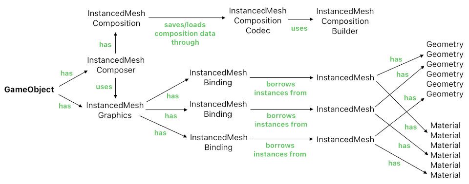

# Instanced Mesh Composition System

Reference: @src/client/graphics/types/mesh/instancedMeshBinding.ts , @src/client/object/components/instancedMeshGraphics.ts , @src/client/graphics/maps/geometryConstructorMap.ts , @src/client/graphics/maps/materialConstructorMap.ts , @src/shared/graphics/mesh/composition/types/compositionCodec/instancedMeshCompositionCodec.ts , @src/shared/graphics/mesh/composition/types/compositionBuilder/instancedMeshCompositionBuilder.ts , @src/client/object/components/helpers/mesh/instancedMeshComposition.ts , @src/client/object/components/instancedMeshComposer.ts

## Overview

The instanced mesh composition system lets any `GameObject` render itself as a collection of simple geometric forms (aka "instances"), by borrowing them from a number of instanced meshes and dynamically assembling them based on its own `InstancedMeshComposition` metadata.

## Components of the System

- Our graphics framework has a number of geometries as well as materials, and each `InstancedMesh` can be thought of as a unique pair between a geometry and a material.
- A `GameObject` may borrow instances from an `InstancedMesh` with the help of an `InstancedMeshBinding`, which is a module that keeps track of all the instances of that particular type of `InstancedMesh` that the object has reserved.
- The `InstancedMeshGraphics` component is just a facade which routes function calls to the appropriate bindings.
- The `InstancedMeshComposer` component is the central engine of the `GameObject`'s composition-based rendering logic. It converts the object's metadata into the appropriate geometric forms (i.e. `InstancedMeshCompositionPart[]`) by means of a helper module called `InstancedMeshComposition`. Based on what's loaded, `InstancedMeshComposer` then updates the corresponding mesh instances through `InstancedMeshGraphics` (i.e. It dynamically rents, transforms, and/or returns mesh instances based on which geometric forms (parts) are currently loaded).
- `InstancedMeshComposition` internally uses a codec of the appropriate type (i.e. `InstancedMeshCompositionCodec`) for encoding/decoding the composition metadata.
- `InstancedMeshCompositionCodec` may utilize `InstancedMeshCompositionBuilder`'s helper methods in order to efficiently place geometric forms in their right dimensions (e.g. offsets, directions, scales).

## Related docs

- [Player Customization](../geometry/player_customization.md) — primary use case of the instanced mesh composition system