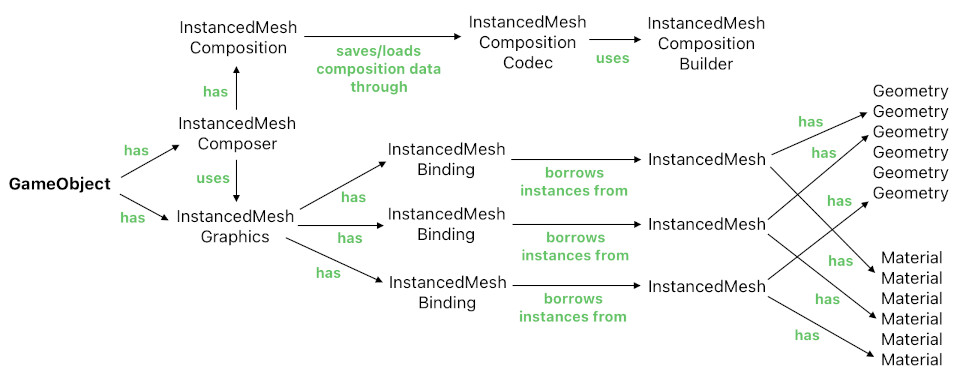

# Instanced Mesh Composition System

Reference: @src/client/graphics/types/mesh/instancedMeshBinding.ts , @src/client/object/components/instancedMeshGraphics.ts , @src/client/graphics/maps/geometryConstructorMap.ts , @src/client/graphics/maps/materialConstructorMap.ts , @src/shared/graphics/mesh/composition/types/compositionCodec/instancedMeshCompositionCodec.ts , @src/shared/graphics/mesh/composition/types/compositionBuilder/instancedMeshCompositionBuilder.ts , @src/client/object/components/helpers/mesh/instancedMeshComposition.ts , @src/client/object/components/instancedMeshComposer.ts

## Overview

The instanced mesh composition system lets any `GameObject` render itself as a collection of simple geometric forms (aka "instances"), by borrowing them from a number of instanced meshes and dynamically assembling them based on its own `InstancedMeshComposition` metadata.

## Components of the System

- Our graphics framework has a number of geometries as well as materials, and each `InstancedMesh` can be thought of as a unique pair between a geometry and a material.
- A `GameObject` may borrow instances from an `InstancedMesh` with the help of an `InstancedMeshBinding`, which is a module that keeps track of all the instances of that particular type of `InstancedMesh` that the object has reserved.
- The `InstancedMeshGraphics` component is just a facade which routes function calls to the appropriate bindings.
- The `InstancedMeshComposer` component is the central engine of the `GameObject`'s composition-based rendering logic. It converts the object's metadata into the appropriate geometric forms (i.e. `InstancedMeshCompositionPart[]`) by means of a helper module called `InstancedMeshComposition`. Based on what's loaded, `InstancedMeshComposer` then updates the corresponding mesh instances through `InstancedMeshGraphics` (i.e. It dynamically rents, transforms, and/or returns mesh instances based on which geometric forms (parts) are currently loaded).
- `InstancedMeshComposition` internally uses a codec of the appropriate type (i.e. `InstancedMeshCompositionCodec`) for encoding/decoding the composition metadata.
- `InstancedMeshCompositionCodec` may utilize `InstancedMeshCompositionBuilder`'s helper methods in order to efficiently place geometric forms in their right dimensions (e.g. offsets, directions, scales).

## Naming a Composition Instead of Spelling It Out

An object's metadata is stored once per object — in the room the server holds, in every copy sent to a client, and in the room's saved contents. An appearance spelled out part by part is therefore paid for once per object that wears it, which is what stops a single kind of object from having a great many look-alike variants.

`IndexedCompositionCodec` is the way out, and it is a **router rather than a format**. What the object stores is only a position in `PreEncodedCompositionStringMap`; the real composition lives at that position, carrying its own codec prefix, and the Indexed codec hands it straight to whichever codec wrote it. So an object's whole appearance costs the same handful of characters however many parts it is drawn from.

The table itself is not written by hand. Compositions are authored in a source file under the game's assets and encoded at build time by `PreEncodedCompositionBuilder`, which runs as part of the static-site generation step and regenerates `PreEncodedCompositionStringMap`. Authoring a new variant is therefore an edit to data rather than new code, which is the other half of the saving: the alternative — a bespoke codec or builder per variant — buys small metadata at the cost of a growing client bundle.

Two consequences worth knowing:

- **A field the authored composition cannot know is left indeterminate**, and the object fills it in after decoding. A lamp's lit face is the example: its color is derived from the light the lamp gives off, so it cannot be settled ahead of time and is written over every time the composition is rebuilt.
- **An indexed appearance is read-only.** The codec can name a composition but cannot write one back, so an object whose appearance a user edits and saves is not a candidate for it.

## Hiding One Instance

Every instance of an `InstancedMesh` is drawn in the same draw call, so the mesh's visibility is shared by all of them and cannot single one out. An individual instance is therefore hidden by parking it far outside the room — which is also what an instance does once it is returned, so that a mesh never draws its unused instances.

An instance may additionally be hidden *temporarily*, by something other than its owner, for as long as it happens to be in the way of something (see [Camera Control](camera_control.md)). Since its owner goes on renting, transforming, and returning instances unaware of any of this, `InstancedMeshBinding` holds on to the transforms baked for a hidden instance instead of drawing them, and applies the most recent one as soon as the instance is shown again. An instance that is returned while hidden stops being hidden, since whoever rents it next owns it.

## Related docs

- [Player Customization](../geometry/player_customization.md) — primary use case of the instanced mesh composition system
- [Door Design](../geometry/door_design.md) — a door is composed the same way, out of moulded quads
- [Camera Control](camera_control.md) — hides instances that stand between the orbit camera and what it frames