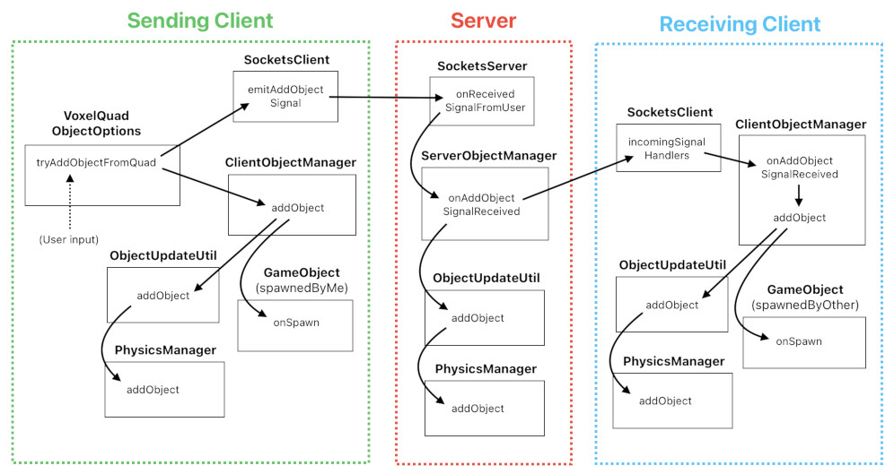
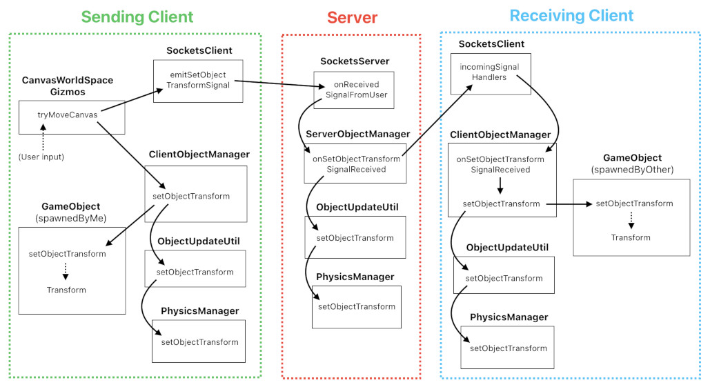
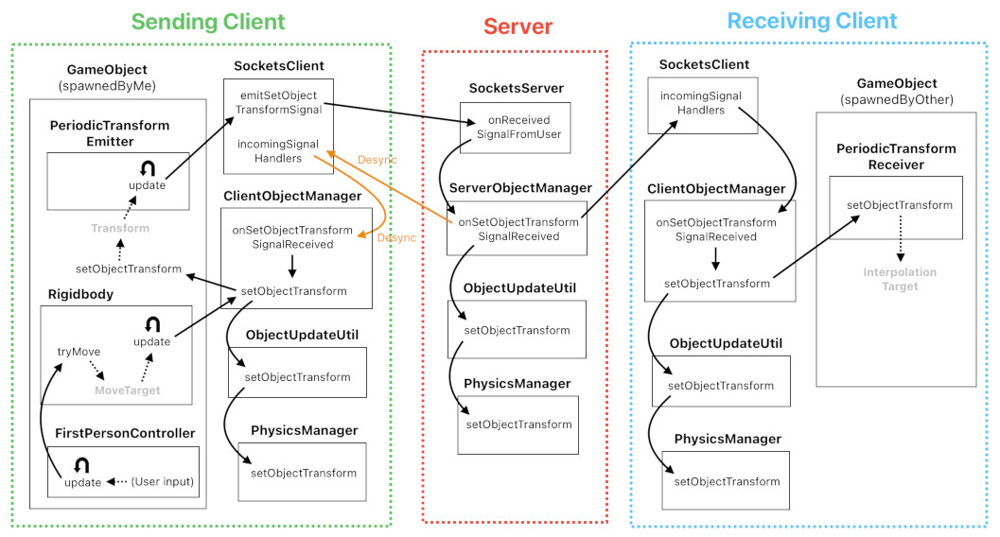

# Object Update Flows

Reference: @src/shared/object/util/objectUpdateUtil.ts , @src/server/object/serverObjectManager.ts , @src/client/object/clientObjectManager.ts , @src/shared/physics/physicsManager.ts

## Add Object

1. The client triggers object addition via user input. `ObjectUpdateUtil.addObject` registers the object and `PhysicsManager.addObject` creates its `PhysicsObject`. `ClientObjectManager.addObject` spawns a `GameObject` (with `spawnedByMe` components). The client then emits an `AddObjectSignal` (with a locally computed objectId) to the server.
2. The server receives the signal and calls `ObjectUpdateUtil.addObject` to validate. It compares the server-computed objectId with the one in the signal.
    - If the objectIds match and all conditions are satisfied: the server multicasts the `AddObjectSignal` to everyone except the sender. Other clients register the object, create its `PhysicsObject`, and spawn a `GameObject` (with `spawnedByOther` components).
    - If the objectIds don't match or any condition fails: the server unicasts a `RemoveObjectSignal` back to the sender to roll back the optimistic addition.

## Remove Object
1. The client validates via `ObjectUpdateUtil.canRemoveObject`, then calls `ObjectUpdateUtil.removeObject` to delete the object and its `PhysicsObject`. `ClientObjectManager.removeObject` despawns the `GameObject`. The client emits a `RemoveObjectSignal` to the server.
2. The server calls `ObjectUpdateUtil.removeObject` to validate and remove the object.
    - If removal succeeds: the server multicasts the `RemoveObjectSignal` to everyone except the sender. Other clients remove the object and despawn its `GameObject`.
    - If removal fails: the server logs an error. No rollback signal is sent (the client-side removal was already applied optimistically).

## Set Object Transform

**Non-physical objects** (e.g. canvas objects dragged via world-space gizmos):

**Physical objects** (e.g. player objects with Rigidbody, FirstPersonController, and PeriodicTransformEmitter/Receiver):

1. The client sends a `SetObjectTransformSignal` (with the objectId and full absolute transform) to the server.
    - **Non-physical objects**: The user triggers a displacement of the object via a world-space gizmo (such as `CanvasWorldSpaceGizmos`), which computes the new position and updates the shared state via `ObjectUpdateUtil.setObjectTransform` → `PhysicsManager.setObjectTransform` (with `ignorePhysics: true`), then emits the signal.
    - **Physical objects**: A controle module (such as `FirstPersonController`) triggers the object's motion via `Rigidbody.tryMove`. The `PeriodicTransformEmitter` periodically checks for changes and emits the signal if the transform has changed beyond a threshold. On receiving clients, `PeriodicTransformReceiver` interpolates toward the received transform.
2. The server calls `ObjectUpdateUtil.setObjectTransform`, which validates and calls `PhysicsManager.setObjectTransform`. The `ignorePhysics` flag determines whether the movement should be influenced by the laws of physics or not.
    - **If `ignorePhysics` is false** (dynamic collider objects): The physics engine resolves the transform against constraints (collision, step-up, gravity). If desync is detected, the server multicasts the server-authoritative position to **all** clients (including the sender). Otherwise, it multicasts to everyone except the sender.
    - **If `ignorePhysics` is true** (static/non-collider objects): The object is placed directly at the requested position. The server multicasts to everyone except the sender.

## Set Object Metadata
1. The client validates via `ObjectUpdateUtil.canSetObjectMetadata`, then calls `ObjectUpdateUtil.setObjectMetadata` to apply the change locally. The client emits a `SetObjectMetadataSignal` (with objectId, metadataKey, and metadataValue) to the server.
2. The server calls `ObjectUpdateUtil.setObjectMetadata` to validate and apply.
    - If the update succeeds: the server multicasts the signal to everyone except the sender. Other clients apply the metadata change.
    - If the update fails: the server unicasts a `SetObjectMetadataSignal` back to the sender with the current server-side value, reverting the optimistic change.
