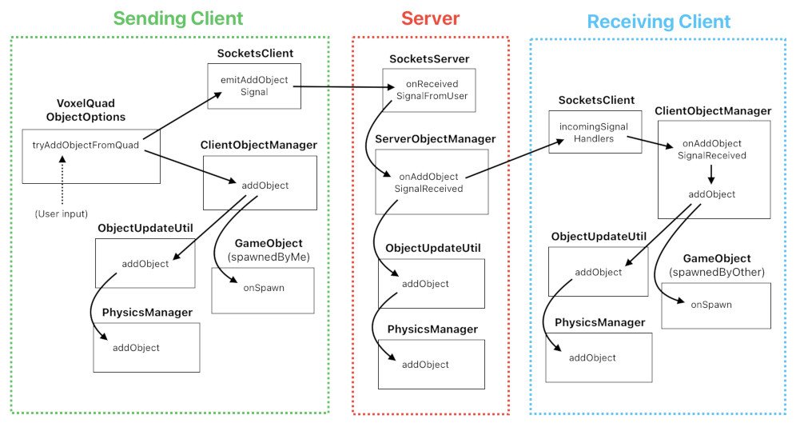
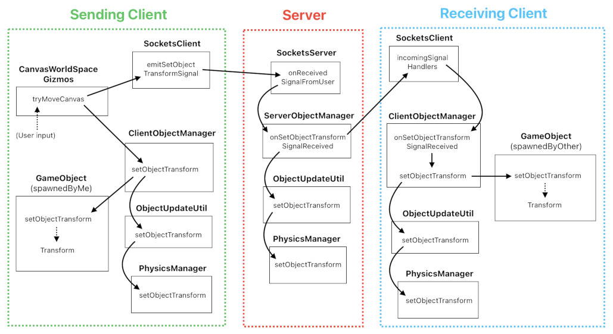
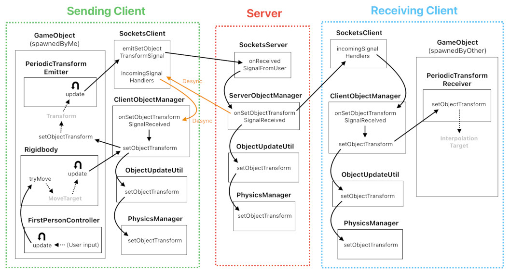

# Object Update Flows

Reference: @src/shared/object/util/objectUpdateUtil.ts , @src/server/object/serverObjectManager.ts , @src/client/object/clientObjectManager.ts , @src/shared/physics/physicsManager.ts

## Add Object

1. On user input, the client optimistically adds the object: `ObjectUpdateUtil` registers it, `PhysicsManager` creates its physics body, and `ClientObjectManager` spawns the visible object (marked as spawned-by-me). The client then emits an `AddObjectSignal` to the server, including a locally computed object id.
2. The server re-runs the same validation and recomputes the object id.
    - **If it matches and all conditions hold:** the server relays the `AddObjectSignal` to everyone else, who register the object and spawn it (marked as spawned-by-others).
    - **If not:** the server sends a `RemoveObjectSignal` back to the sender to roll back the optimistic addition.

## Remove Object
1. The client validates, optimistically removes the object and its physics body, despawns it, and emits a `RemoveObjectSignal`.
2. The server validates and removes it.
    - **On success:** it relays the `RemoveObjectSignal` to everyone else, who remove and despawn the object.
    - **On failure:** it logs an error. No rollback is sent, since the removal was already applied optimistically.

## Restricted Zones
Adding, moving, removing and changing the metadata of an object are each refused where the object is one the room keeps and its collider would meet one of the room's restricted zones — unless the user is the one the room answers to (see [restricted_zone.md](../gameplay/restricted_zone.md)). Moving such an object *out* of a zone is refused along with moving one in, since allowing the way out would leave the removal rule undone in two steps instead of one. Metadata is included because what a picture hanging inside a zone shows is as much a part of that stretch of the room as the wall behind it.

Objects the room does not keep are never in question, which is also what keeps this off the path a player's own movement runs down.

## Local-Only Objects
Some objects exist only on the client and must never enter the synced room state — the render objects spawned from the voxel grid, for example. These are spawned during room load (with client-only ids) and torn down without ever being registered in the room's object set or persisted, and without emitting any add/remove signal. They still get a physics body when their type defines a collider, so they can participate in collision while remaining purely client-side and identical across clients.

## Set Object Transform

**Non-physical objects** (e.g. canvas objects dragged via world-space gizmos):

**Physical objects** (e.g. player objects with a rigidbody, controller, and transform emitter/receiver):

1. The client sends a `SetObjectTransformSignal` carrying the object's full absolute transform.
    - **Non-physical objects:** a world-space gizmo computes the new position, updates the shared state ignoring physics, then emits the signal.
    - **Physical objects:** a control module drives the object's motion, and a transform emitter periodically emits the signal when the transform has changed beyond a threshold. Receiving clients interpolate toward the received transform.
2. The server validates and applies the transform.
    - **Physics-resolved (dynamic colliders):** the engine resolves the transform against collision, step-up, and gravity. If the result diverges from what the client requested, the server broadcasts the authoritative position to **all** clients (including the sender); otherwise it relays to everyone else.
    - **Physics-ignored (static / non-collider objects):** the object is placed directly at the requested position and relayed to everyone else.

### How a position is stored

`ObjectTransform` does not store a coordinate. It stores each component as a fraction of a fixed
range and multiplies it back out on the way in, which is what lets a position travel in far fewer
bytes than its precision would otherwise need.

The consequence is that **those ranges are part of the stored format**, not a description of the
room. A stored position means whatever the range says it means at the moment it is read, so widening
a range moves every object already in storage — silently, with no byte of stored data changing and
nothing failing. The ranges are therefore held apart from the room's own dimensions and left frozen:
a room is free to change size, and when it grows past one of them the answer is a new `ObjectGroup`
version with a converter, never a wider range.

`ObjectGroup`'s version alone cannot always date what it holds, because a change of this kind alters
what the bytes mean without altering how they are laid out — so a version can span both sides of it.
A room's objects are stored in the same blob as its `VoxelGrid`, and that grid's version is what
dates them.

## Set Object Metadata
1. The client validates, applies the metadata change locally, and emits a `SetObjectMetadataSignal`.
2. The server validates and applies it.
    - **On success:** it relays the signal to everyone else, who apply the change.
    - **On failure:** it sends the signal back to the sender carrying the current server-side value, reverting the optimistic change.

## Signal Optimization for Continuous Updates
For signals that update frequently (e.g. object transforms), the server replaces the most recent pending signal of that type rather than queuing a new one, so a backlog of stale updates never builds up during high-frequency motion.
