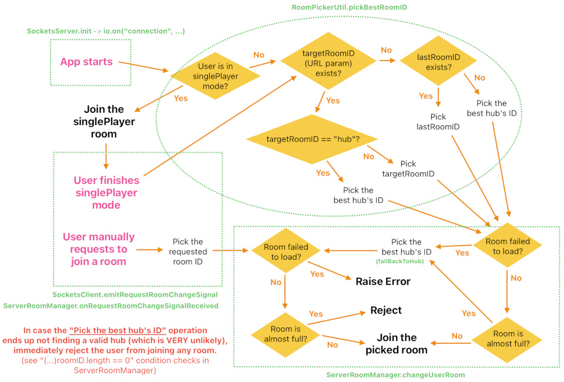
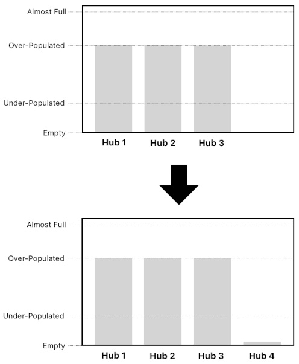
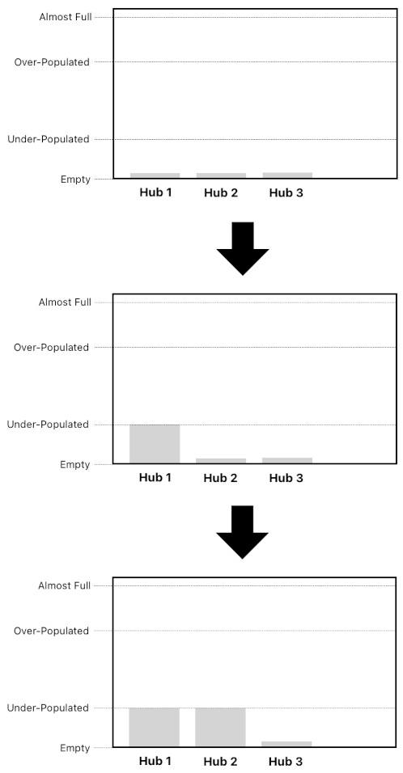
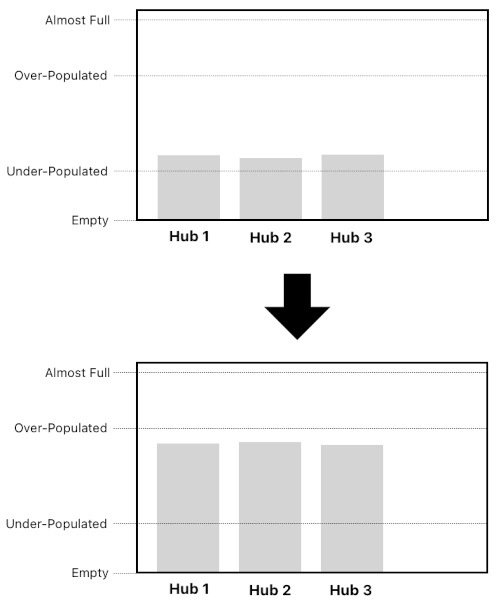

# Room Population Flows

Reference: @src/shared/system/sharedConstants.ts , @src/server/room/serverRoomManager.ts , @src/server/room/util/roomPickerUtil.ts , @src/server/room/util/hubRoomUtil.ts , @src/server/user/serverUserManager.ts , @src/shared/room/types/roomChangeRejectedSignal.ts

> For how the user's destination is chosen on connect, and how single-player rooms sit outside these rules, see [user_state_management.md](user_state_management.md) and [single_player_mode.md](single_player_mode.md).

## Why a room's population is bounded

Every player standing in a room costs each of the other clients in that room a fixed share of resources: a slice of the client's per-room instanced-mesh pool for the player's body, plus the physics and networking work of keeping that player in sync. Both costs are borne by everyone in the room, so an unbounded room degrades the experience for all of its occupants and can exhaust the mesh pool outright.

Two mechanisms follow from this:

- **A hard cap** (`MAX_PLAYERS_PER_ROOM`) that no room may exceed, whatever route a user takes into it. In practice a room stops admitting users slightly below it — see [Population bands](#population-bands).
- **Load balancing across the hubs**, so that users spread out long before any single hub approaches that cap.

## Population bands

A room's population is the number of users currently registered as its participants. Three lines divide it into bands:

- **Under-populated** — at or below `ROOM_UNDER_POPULATION_THRESHOLD`. The room has capacity to spare and, more importantly, too few people in it to be worth visiting.
- **Medium-populated** — between the under- and over-population thresholds. This is the healthy band.
- **Over-populated** — at or above `ROOM_OVER_POPULATION_THRESHOLD`. The room still has free slots, but it is a bit too crowded. Thus, new users should be routed into other rooms if possible.
- **Almost full** — close enough to the hard cap that the room stops admitting anyone new. A margin of slots is deliberately left unused so that the joins which may already be in flight cannot carry the room past the hard cap. From a user's point of view an almost-full room simply *is* full.

Deciding whether a room can take another player and registering that player are separated by asynchronous work, so a large enough burst of simultaneous joins can still slip past the margin. The cap is therefore treated as a target rather than an invariant: rather than paying to enforce it exactly, the client degrades gracefully when a room holds more players than it has mesh instances for (see [Running short of instances](#running-short-of-instances)).

## Choosing a destination

Every route into a multiplayer room converges on the same two stages: `RoomPickerUtil` decides *which* room the user is headed for, and `ServerRoomManager` decides whether they are actually allowed in.

The picker is consulted when the user has not named a room themselves — on app start-up, when single-player mode ends, and when a door that leads nowhere sends the user back out. It prefers an explicit room ID from the URL, then the room from the user's last session, and otherwise falls through to the hub balancer described below. The reserved `hub` keyword in the URL routes straight to that balancer.

Where in the destination room the user lands is a separate question, decided from the doors that room holds — see [room_entrance.md](../geometry/room_entrance.md#player-spawning).

## Picking a hub

Whenever a user needs *a* hub rather than a specific one, `RoomPickerUtil` chooses it. All hubs are kept resident in memory (see [Hub residency](#hub-residency)), so the choice costs no database query. Hubs that are almost full are excluded outright, and the remaining ones fall into one of three cases.

**Every hub is over-populated.** A brand new hub is opened and the user is sent there. This is also what happens when the server has no hub at all yet, and it is the same path an admin opening a hub by hand goes down (see [admin.md](../gameplay/admin.md)) — so a hub is preloaded and load-balanced over however it came into being.

Concurrent arrivals that all find every hub over-populated share a single hub creation between them, so a burst of traffic opens one new hub rather than one per user. In the unlikely event that the new hub cannot be made available, the user falls back to the emptiest hub that can still take them.

**At least one hub is under-populated.** The user joins one of them — and keeps joining *the same one* until it grows past the under-population threshold, at which point the next under-populated hub takes over. Filling hubs one at a time is deliberate: spreading the first arrivals evenly would leave every hub with a couple of lonely visitors, and a hub exists to be a meeting place. The choice among the under-populated hubs is ordered by room ID, which keeps it deterministic.

**Every hub is medium-populated.** The emptiest one wins, so the hubs fill up evenly from there on.

## Entering a specific room

A room change carries a flag distinguishing the two kinds of destination a user can end up with:

- **A destination the user picked by name** — the room a door leads to, or their own room. If it cannot be entered, the request is simply refused.
- **A destination the server routed them to** — the room from their last session, a room ID carried in the connection URL, or the reserved hub keyword. If it cannot be entered, the user is re-routed to a hub instead of being left without a room.

"Cannot be entered" covers both a room that is already almost full and a room that no longer loads at all.

`ServerRoomManager` vets the destination *before* the user gives up the room they are currently in. That ordering is what makes a refusal harmless: a user turned away from a full room stays exactly where they were, rather than being stranded in no room at all. Re-entering a room one already occupies is never blocked by one's own slot, since that slot is released on the way in.

## Telling the user

When a room change will not happen, the server sends a `RoomChangeRejectedSignal` carrying a `RoomChangeRejectionReason` instead of the usual `RoomChangedSignal`. The client is blocking on a full-screen loading indicator at that point, so the signal is what releases it; the client then shows the reason as a brief notification and leaves the user where they are.

## Running short of instances

Each client draws the players around it from instanced meshes whose pools are sized for a full room. Should a room ever hold more players than that — the population rules make it unlikely, not impossible — the pools run dry, and a part that cannot get an instance is simply left undrawn until one frees up. Everything else in the room keeps rendering as usual, so the worst outcome is a few incomplete-looking characters rather than a stalled scene. The same applies to any other instanced object a room is allowed a fixed number of, such as its canvases.

## Hub residency

A Regular room is unloaded from memory as soon as its last participant leaves. A hub is not: the room picker load-balances incoming users by scanning the hubs held in memory, so evicting them would turn every join into a database query. Hubs are therefore preloaded at server start-up (`HubRoomUtil`) and stay resident, empty or not.
