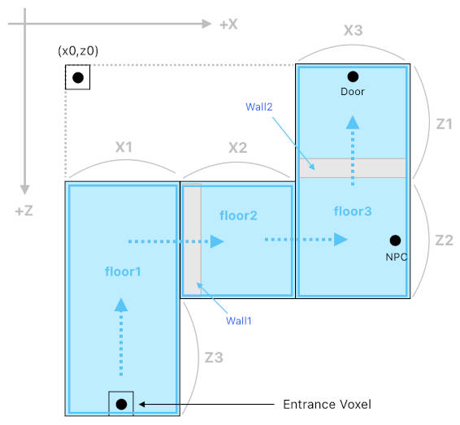

# Single-Player Mode

Reference: @src/shared/room/types/roomType.ts , @src/shared/system/types/featureFlag.ts , @src/server/room/util/roomPickerUtil.ts , @src/server/sockets/socketsServer.ts , @src/shared/singlePlayer/maps/singlePlayerModeConfigMap.ts , @src/shared/room/types/roomMap.ts , @src/server/ssg/builder/roomMapBuilder.ts , @src/shared/object/util/objectTagUtil.ts , @src/shared/object/types/objectTypeConfig/volumeObjectTypeConfig.ts , @src/client/singlePlayer/singlePlayerManager.ts , @src/client/singlePlayer/util/singlePlayerRoomLoadUtil.ts , @src/client/singlePlayer/util/singlePlayerRoomQueryUtil.ts , @src/client/singlePlayer/util/roomEditorUtil.ts , @src/client/singlePlayer/maps/singlePlayerModeClientConfigMap.ts , @src/client/singlePlayer/maps/singlePlayerActionMap.ts , @src/client/singlePlayer/maps/singlePlayerConditionMap.ts

A single-player room is explored alone and runs entirely on the client. Its main use is the first-time **tutorial**, a scripted experience isolated from other players and from persistence.

## Two independent pieces of state
- **`RoomType` single-player**: a shared template (one per name, no owner) that each client loads from a room file and edits as its own local copy. The server never stores or mutates it.
- **The user's single-player mode** (on `User`/`DBUser`): which experience, if any, to route the user into on connect. New users start routed to the tutorial. An empty value means finished.

**The client decides whether to run single-player logic from the joined room's `RoomType`**, never from the user flag, so single-player logic can never run in a multiplayer room or the reverse.

## Routing
On connect, `SocketsServer` picks, in order: the single-player room (if the flag is set), the URL's room, the last room, a hub. While the tutorial is unfinished, a URL room is deferred: the client remembers it and uses it when the tutorial is skipped. The reserved **hub keyword** is a pseudo room id that `RoomPickerUtil` resolves to a balanced hub (see [room_population.md](room_population.md)).

## Server contract
- The server sends only the room's identity, and the client fills the room in from its file (see [Rooms](#rooms)).
- A mode its `SinglePlayerModeConfig` marks admin-only (the room editor) is refused to everyone else.
- The user is not registered as a participant, no last room is written, and nothing is removed on exit.
- As defense in depth, room-mutating handlers in `ServerObjectManager` and `ServerVoxelManager` find no bound room and reject the edit. Client edit paths and the transform emitter also skip their signals in single-player rooms.
- `RoomValidationUtil` allows editing in single-player rooms, since edits stay local.

## Rooms

- A single-player room is authored by hand and ships as a **room file** under the assets (`RoomFile`; see [my_room.md](my_room.md#room-files)), which the client fetches by URL as it does an image.
- `RoomMap` is the rooms' counterpart of `ImageMap` (see [image_map.md](../graphics/image_map.md)). During SSG, `RoomMapBuilder` lists the room files under a seed's directory in a generated module, and fails the build on a file this build cannot read. A `SinglePlayerModeConfig` names its room by a **roomPath** in that map and says nothing else about it.
- The file is fetched before the client leaves the room it is in. If it can't be had or read, the client asks for a multiplayer room instead, and the mode stays unfinished.
- Steps never know where anything stands, only what the room's author called it (`SinglePlayerRoomQueryUtil`):
  - an object by one of its **tags** (`Tags` metadata, `ObjectTagUtil`): keywords an admin gives an object of any type;
  - a stretch of the room by the name of the **volume** that marks it (`VolumeObjectTypeConfig`): a named box of blocks that draws nothing and stops nobody;
  - a spot with no object of its own by a placeholder object carrying a tag. The player starts on the floor under the object tagged as the start, or in the middle of a room with none.
- A thing the room lacks is reported once and read as nothing, so a step carries on as well as it can.
- The tutorial is a single storey: a row of small rooms separated by walls that steps take down, each under a volume of its name. Its fixtures are the receptionist (an NPC; see [player_customization.md](../geometry/player_customization.md)) and the exit door.

### Room editor
- A single-player mode of its own, open to admins only, with no steps: the admin edits the room with every edit-mode tool, as the superuser of a room nobody else is in.
- It opens on an empty room or on a room file, and saves the room as a file. Nothing of it reaches the server, and leaving it finishes no mode.
- It is driven from the debug panel's command input: `new room`, `open room`, `save room` and `leave room`.
- Room settings are applied locally there and saved with the file. Tags are edited only there.
- Volumes are hidden there as anywhere, until `volumes on` (see [restricted_zone.md](../gameplay/restricted_zone.md#display)).
- A saved file ships once it is put in the room map's directory, under the path a mode names.
- **Trap**: room files are static assets, which reach every running build at once (see [deployment.md](../devOps/vps/deployment.md)). An edit that the live build's steps cannot play belongs under a new roomPath.

## Scripted steps
- `SinglePlayerModeConfig` (shared) names the mode's room and who may enter it. `SinglePlayerModeClientConfig` (client) defines named `SinglePlayerStep`s and a teardown.
- A step has **start actions**, **transition rules** (all requirements met → next step after a delay; the first matching rule wins; "none" ends the mode) and **end actions**. Steps refer to each other by name.
- `SinglePlayerManager` evaluates transitions every frame. A single observable holds the current mode and step, and changing it runs the end and start actions.
- `SinglePlayerAction` and `SinglePlayerCondition` are tagged variants dispatched through client maps. A new tutorial capability is a new variant plus its handler, with no per-step code. Actions cover tutorial UI, gizmos, feature flags, camera holds, poses and distance, local world edits, selection (including what edit mode opens on and narrowing what the user may select to a single quad), hiding the user's own character, metadata, cosmetic animations and finishing. Conditions observe local state such as proximity, mode, selection, blocks, quad textures, the user's edit tally, camera movement since a noted view, and chat or metadata tests.
- A quad is addressed everywhere by its index, and a **UI element by its DOM id**, which a step may compute (e.g. one cell of the texture strip). An element pointed at is scrolled into view within whatever list holds it.
- **Parameters are functions** (`SinglePlayerParam`) evaluated against the running game, normally when the action runs. An action that sets up something for later (what edit mode opens on) evaluates them when that happens instead. An action can store a computed value under a name for the rest of the mode, so several later actions can target the same thing.
- A step's own actions override constraints that the step itself imposed (e.g. a locked selection).
- To teach an *act* rather than an outcome, conditions wait on a tally of manual edits (not on a specific cell), or on the camera having moved away from a view the step noted.

## Presentation and constraints
- **Tutorial UI** (observable-backed and non-blocking for pointers): headline banner, arrow and outline that track a DOM element, and a gesture diagram. **World gizmos** (always on top): navigation arrow, point-of-interest arrow, quad outline. A single "clear" action removes all of them.
- The two gizmos that mark a **face** hide themselves whenever that face is out of sight — something drawn in between, or the camera behind it. They draw on top of everything, so otherwise they would hang in the middle of the wall in the way.
- **`FeatureFlag`**: an observable set of switches that restrict the UI and interactions (e.g. hide chat, disable voxel edits, lock selection, lock game mode, block undo and redo). A flag restricts the **action itself**, not just the button for it (e.g. the mode lock also blocks the toggle's shortcut key).
- **Selection restriction**: separate from the selection lock, which refuses every quad. A step that asks the user to pick a face out lifts the lock and leaves only that one face selectable, so a stray click can't strand the steps that act on it.

## Finishing
- The tutorial's exit is an ordinary door pointed at the hubs.
- Arriving in a non-single-player room triggers the finish command. The server verifies the user was in the tutorial and clears the flag in memory and in the DB. Skipping sends the user to the picker instead, which honors a deferred URL room.
- [FTUE](ftue.md) takes over afterwards.
