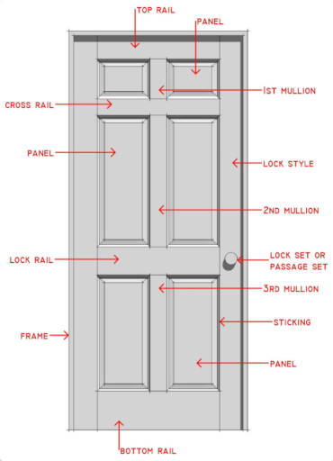
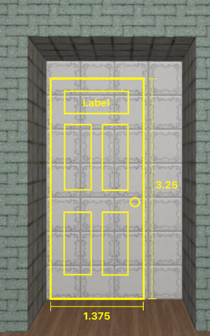
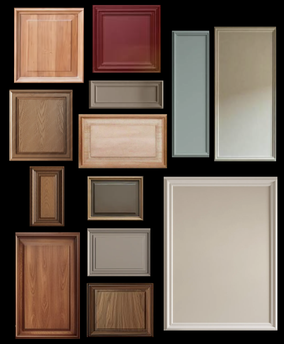

# Refactoring of the Door Object

## Problem

So far, we have been using a custom door image for the room's entrance door. This has been fine because each room has only been equipped with a single door called "entrance door".

In the future, however, we will be allowing the user to attach his own doors on the wall, each of which will be a gateway to another room. In order to implement this feature successfully, we need to first deal with the following issues:

1. The door is way too oversized. When attached to a wall, it occupies the distance of 3 (i.e. three voxel blocks) on the x/z-axis and about 7.5 (i.e. seven and a half collision layers) on the y-axis. Such an enormous size will make it difficult for the user to reserve enough space on the wall as to place a door on it.
2. There is no variety in the door's appearance. Since the door object (i.e. `DoorGameObject`) only displays itself using a single door image, a multitude of doors will all look alike and end up confusing the user. This means we need a way to programmatically generate a sufficient variety of door visuals.
3. The current door image lacks a place to include a label. As custom doors get introduced, we will eventually be attaching a unique label to each of the doors to let the user know the name of its destination. Therefore, we need to make sure that the door will reserve enough space for a label on which the destination room's title can be written.

## Solution

### Door Design Standards

First of all, we need to establish a standard template out of which doors can be designed, for without such a fixed guideline, we will easily get lost in the abyss of endless possibilities.

The most recognizable and aesthetically pleasing template, in my opinion, is that of a wooden door with mouldings - like the ones which appear commonly in 20th century American houses. The picture below is an illustration of it which I found on the web.

The idea is, we can first base our design of custom doors upon this standard, and then vary some of its aspects (e.g. colors, moulding patterns, etc) by means of parameterization.

### Compact and Realistic Door Dimensions

In order for custom doors to fit inside the room's walls appropriately, we need to ensure that the following criteria are satisfied:

1. Each `DoorGameObject` will be a wall-attached object (similar to `CanvasGameObject`), and end up physically occupying the size of 1.5 on the wall's horizontal axis and 3.5 on the wall's vertical axis (in the context of object placement logic).
2. A door's mesh (i.e. visible portion), on the other hand, must be of size 1.375 on the horizontal axis and 3.25 on the vertical axis (centered horizontally and stuck to the bottom vertically, with respect to the area it physically occupies). The purpose of this is: (1) to leave enough margin between the door and the top of the wall, as well as between doors that are adjacent to each other, and (2) to fix the door's aspect ratio at a reasonable degree.
3. For aesthetics and better recognizability, let us also add rectangular regions upon the surface of the door, whose boundaries are antique wooden mouldings. The topmost inner region should have a different background color, since it is going to be where the destination room's label will be written. We ought to also ensure that this label's background and font (both their shape and color) fit the door's overall color scheme. Besides, the label should be clearly identifiable yet not so distinctive as to overwhelm the rest of the door's visual harmony.
4. The door's knob (which is slightly below 1.5 on the y-axis) should ideally be rendered as a shaded circle, yet creating such an exception to the rendering procedure may be too wasteful of resources and may even complicate the code too much. Therefore, let us assume that the knob is of a square shape for now (for the sake of consistency and simplicity).

See the picture below for further details.

### Procedural Door Mesh via InstancedMeshComposition

Here is how the rendering of `DoorGameObject` can be refactored. Instead of fetching a door image from a URL and drawing it on a single quad, we can dynamically assemble a bunch of quads (i.e. mesh instances) to generate the appearance of a door (without using any texture asset whatsoever). Each quad will be responsible for rendering a distinct rectangular region with mouldings near its borders, which are scale-independent (i.e. neither stretch nor shrink no matter how much the quad stretches/shrinks). For simplicity, let us also assume that the door's main body and knob, too, are rectangular regions with their own mouldings. Since a knob is of a convex form, however, it may be necessary for us to add an option (probably as a vertex/element buffer attribute) to make each quad's moulding either appear as concave or convex.

From an implementation point of view, we can leverage the existing `InstancedMeshComposition` system (see @docs/graphics/instanced_mesh_composition.md for details). It lets us create a buffer of quad-shaped mesh instances, which we will be able to "compose" upon the surface of a wall to render a door's appearance. For example, we can first put a quad for the door's main body, 5 more (smaller) quads upon this main body for decorative regions and the label, and 1 additional (convex-looking) quad to represent the door's knob. The door's overall frame (around its main body) can be expressed in the form of mouldings, too, for the sake of consistency in the rendering logic as well as the fact that the door's overall outline should have its own decent boundaries too - not just its inner parts.

For visual variety, we may also need to implement a few additional buffer attributes to enable per-instance parameterization of the following:

1. Two customizable colors for each quad (similar to how different parts of the player character are being colored - see: `PlayerCompositionBuilder`) - one for the background, and the other one for the mouldings (outlines).
2. Whether the quad's mouldings are convex or concave.
3. How thick the mouldings should be (in world-space coordinates because mouldings need to be scale-independent).

Ideally, it will be even more fabulous if we manage to support mouldings of different shapes (e.g. how many times the line repeats itself, etc). However, let us not stretch this too far as to end up making the shader code too complex and/or computation-heavy.

For further variety, we may even consider varying the ways in which the rectangular regions are being laid out. For instance, we may combine two regions into one, or let us put three narrow regions instead of just two, etc. But again, the code which drives such variations must not be too complex.

(Side Note 1: We need to be careful not to let the individual quads incur z-fighting. Offsetting them by very small distances (e.g. 0.001) from one another usually works fine on high-end devices such as PCs, but they still seem to end up introducing flickering artifacts (i.e. z-fighting) on mobile devices where the coordinate prcision is generally lower.)

(Side Note 2: Don't worry about rendering a world-space text for the door's label. We will deal with it later on.)

### Shader for Classical Wooden Mouldings

For the aforementioned procedural door graphics to look aesthetically pleasing, though, we will need a new shader for rendering a nice wooden surface with mouldings around it (just like the reason why we came up with the "rusty tin toy" shader for the customizable player character parts - see @docs/geometry/player_customization.md ). 

Any quad which is under the influence of this shader should exhibit an antique-looking wooden surface whose pattern is based on the shader's internal algorithm (instead of a texture asset), and must include mouldings near its edges (borders). The overall colors and other core properties of the wooden surface, as well as those of the mouldings, should be parameterized on a per-quad (per-instance) basis.

Some of the examples of how the resulting quads should look like are depicted in the picture below.

For now, this new shader will be used for parts of `DoorGameObject` only. In the future, however, we might end up also leveraging the same InstancedMesh (i.e. quads + wooden surface shader) for other types of objects which are made up of antique-looking rectangular surfaces, such as furniture (e.g. chair, table), fences, pillars, etc. So, let us keep this future usage in mind when crafting the shader and its material.